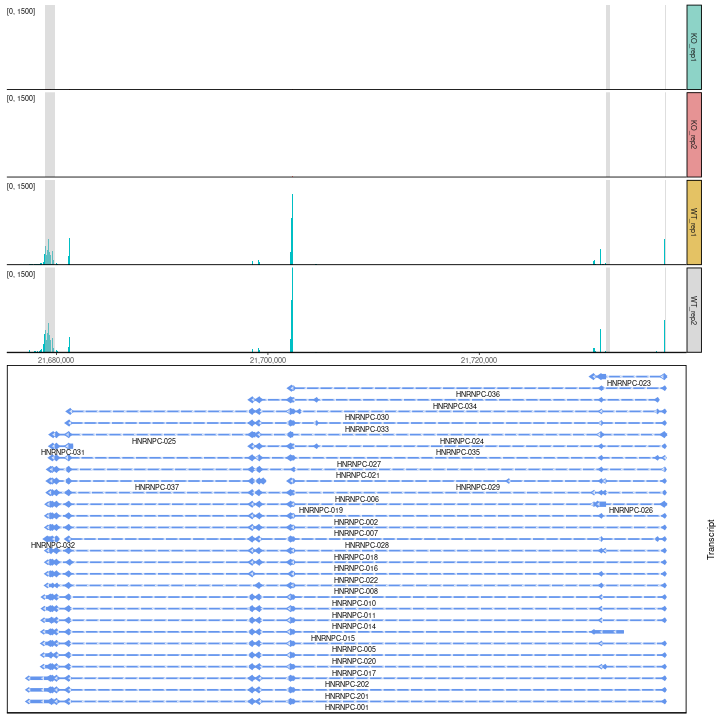

<!-- README.md is generated from README.Rmd. Please edit that file -->

# ggcoverage - Visualize and annotate omics coverage with ggplot2


[](https://cran.r-project.org/package=ggcoverage)

[](https://github.com/showteeth/ggcoverage)

## Introduction

The goal of `ggcoverage` is simplify the process of visualizing omics
coverage. It contains three main parts:

- **Load the data**: `ggcoverage` can load BAM, BigWig (.bw), BedGraph,
  txt/xlsx files from various omics data, including WGS, RNA-seq,
  ChIP-seq, ATAC-seq, proteomics, et al.
- **Create omics coverage plot**
- **Add annotations**: `ggcoverage` supports six different annotations:
  - **base and amino acid annotation**: Visualize genome coverage at
    single-nucleotide level with bases and amino acids.
  - **GC annotation**: Visualize genome coverage with GC content
  - **CNV annotation**: Visualize genome coverage with copy number
    variation (CNV)
  - **gene annotation**: Visualize genome coverage across genes
  - **transcription annotation**: Visualize genome coverage across
    different transcripts
  - **ideogram annotation**: Visualize the region showing on whole
    chromosome
  - **peak annotation**: Visualize genome coverage and peak identified
  - **contact map annotation**: Visualize genome coverage with Hi-C
    contact map
  - **link annotation**: Visualize genome coverage with contacts
  - **peotein feature annotation**: Visualize protein coverage with
    features

`ggcoverage` utilizes `ggplot2` plotting system, so its usage is
**ggplot2-style**!

## Installation

`ggcoverage` is an R package distributed as part of the
[CRAN](https://cran.r-project.org/). To install the package, start R and
enter one of the following commands:

``` r
# install via CRAN (not yet available)
install.packages("ggcoverage")

# OR install via Github
install.package("remotes")
remotes::install_github("showteeth/ggcoverage")
```

In general, it is **recommended** to install from [Github
repository](https://github.com/showteeth/ggcoverage) (update more
timely).

Once `ggcoverage` is installed, it can be loaded (together with other
libraries) like this:

``` r
library("rtracklayer")
library("ggcoverage")
library("ggpattern")
```

## Manual

`ggcoverage` provides two
[vignettes](https://showteeth.github.io/ggcoverage/):

- **detailed manual**: step-by-step usage
- **customize the plot**: customize the plot and add additional layer

## RNA-seq data

### Load the data

The RNA-seq data used here are from [Transcription profiling by high
throughput sequencing of HNRNPC knockdown and control HeLa
cells](https://bioconductor.org/packages/release/data/experiment/html/RNAseqData.HNRNPC.bam.chr14.html),
we select four sample to use as example: ERR127307_chr14,
ERR127306_chr14, ERR127303_chr14, ERR127302_chr14, and all bam files are
converted to bigwig file with
[deeptools](https://deeptools.readthedocs.io/en/develop/).

Load metadata:

``` r
# load metadata
meta_file <-
  system.file("extdata", "RNA-seq", "meta_info.csv", package = "ggcoverage")
sample_meta <- read.csv(meta_file)
sample_meta
#>        SampleName    Type Group
#> 1 ERR127302_chr14 KO_rep1    KO
#> 2 ERR127303_chr14 KO_rep2    KO
#> 3 ERR127306_chr14 WT_rep1    WT
#> 4 ERR127307_chr14 WT_rep2    WT
```

Load track files:

``` r
# track folder
track_folder <- system.file("extdata", "RNA-seq", package = "ggcoverage")
# load bigwig file
track_df <- LoadTrackFile(
  track.folder = track_folder,
  format = "bw",
  region = "chr14:21,677,306-21,737,601",
  extend = 2000,
  meta.info = sample_meta
)
# check data
head(track_df)
#>   seqnames    start      end score    Type Group
#> 1    chr14 21675306 21675950     0 KO_rep1    KO
#> 2    chr14 21675951 21676000     1 KO_rep1    KO
#> 3    chr14 21676001 21676100     2 KO_rep1    KO
#> 4    chr14 21676101 21676150     1 KO_rep1    KO
#> 5    chr14 21676151 21677100     0 KO_rep1    KO
#> 6    chr14 21677101 21677200     2 KO_rep1    KO
```

Prepare mark region:

``` r
# create mark region
mark_region <- data.frame(
  start = c(21678900, 21732001, 21737590),
  end = c(21679900, 21732400, 21737650),
  label = c("M1", "M2", "M3")
)
# check data
mark_region
#>      start      end label
#> 1 21678900 21679900    M1
#> 2 21732001 21732400    M2
#> 3 21737590 21737650    M3
```

### Load GTF

To add **gene annotation**, the gtf file should contain **gene_type**
and **gene_name** attributes in **column 9**; to add **transcript
annotation**, the gtf file should contain **transcript_name** attribute
in **column 9**.

``` r
gtf_file <-
  system.file("extdata", "used_hg19.gtf", package = "ggcoverage")
gtf_gr <- rtracklayer::import.gff(con = gtf_file, format = "gtf")
```

### Basic coverage

The basic coverage plot has **two types**:

- **facet**: Create subplot for every track (specified by `facet.key`).
  This is default.
- **joint**: Visualize all tracks in a single plot.

#### joint view

Create line plot for **every sample** (`facet.key = "Type"`) and color
by **every sample** (`group.key = "Type"`):

``` r
basic_coverage <- ggcoverage(
  data = track_df,
  plot.type = "joint",
  facet.key = "Type",
  group.key = "Type",
  mark.region = mark_region,
  range.position = "out"
)

basic_coverage
```


Create **group average line plot** (sample is indicated by
`facet.key = "Type"`, group is indicated by `group.key = "Group"`):

``` r
basic_coverage <- ggcoverage(
  data = track_df,
  plot.type = "joint",
  facet.key = "Type",
  group.key = "Group",
  joint.avg = TRUE,
  mark.region = mark_region,
  range.position = "out"
)

basic_coverage
```


#### Facet view

``` r
basic_coverage <- ggcoverage(
  data = track_df,
  plot.type = "facet",
  mark.region = mark_region,
  range.position = "out"
)

basic_coverage
```


#### Custom Y-axis style

**Change the Y-axis scale label in/out of plot region with
`range.position`**:

``` r
basic_coverage <- ggcoverage(
  data = track_df,
  plot.type = "facet",
  mark.region = mark_region,
  range.position = "in"
)

basic_coverage
```


**Shared/Free Y-axis scale with `facet.y.scale`**:

``` r
basic_coverage <- ggcoverage(
  data = track_df,
  plot.type = "facet",
  mark.region = mark_region,
  range.position = "in",
  facet.y.scale = "fixed"
)

basic_coverage
```


### Add gene annotation

``` r
basic_coverage +
  geom_gene(gtf.gr = gtf_gr)
```


### Add transcript annotation

**In “loose” stype (default style; each transcript occupies one line)**:

``` r
basic_coverage +
  geom_transcript(gtf.gr = gtf_gr, label.vjust = 1.5)
```


**In “tight” style (place non-overlap transcripts in one line)**:

``` r
basic_coverage +
  geom_transcript(gtf.gr = gtf_gr,
                  overlap.style = "tight",
                  label.vjust = 1.5)
```



### Add ideogram

``` r
basic_coverage +
  geom_gene(gtf.gr = gtf_gr) +
  geom_ideogram(genome = "hg19", plot.space = 0)
#> Loading ideogram...
#> Loading ranges...
#> Scale for x is already present.
#> Adding another scale for x, which will replace the existing scale.
```


``` r
basic_coverage +
  geom_transcript(gtf.gr = gtf_gr, label.vjust = 1.5) +
  geom_ideogram(genome = "hg19", plot.space = 0)
#> Loading ideogram...
#> Loading ranges...
#> Scale for x is already present.
#> Adding another scale for x, which will replace the existing scale.
```


## DNA-seq data

### CNV

#### Example 1

##### Load the data

The DNA-seq data used here are from [Copy number work
flow](http://bioconductor.org/help/course-materials/2014/SeattleOct2014/B02.2.3_CopyNumber.html),
we select tumor sample, and get bin counts with
`cn.mops::getReadCountsFromBAM` with `WL` 1000.

``` r
# prepare metafile
cnv_meta_info <- data.frame(
  SampleName = c("CNV_example"),
  Type = c("tumor"),
  Group = c("tumor")
)

# track file
track_file <- system.file("extdata",
                          "DNA-seq", "CNV_example.txt", package = "ggcoverage")

# load txt file
track_df <- LoadTrackFile(
  track.file = track_file,
  format = "txt",
  region = "chr4:61750000-62,700,000",
  meta.info = cnv_meta_info
)

# check data
head(track_df)
#>   seqnames    start      end score  Type Group
#> 1     chr4 61748000 61748000    25 tumor tumor
#> 2     chr4 61748001 61749000    24 tumor tumor
#> 3     chr4 61749001 61750000    17 tumor tumor
#> 4     chr4 61750001 61751000    23 tumor tumor
#> 5     chr4 61751001 61752000    14 tumor tumor
#> 6     chr4 61752001 61753000    22 tumor tumor
```

##### Basic coverage

``` r
basic_coverage <- ggcoverage(
  data = track_df,
  color = "grey",
  mark.region = NULL,
  range.position = "out"
)
basic_coverage
```


##### Add GC annotations

Add **GC**, **ideogram** and **gene** annotaions.

``` r
# load genome data
library("BSgenome.Hsapiens.UCSC.hg19")
#> Loading required package: BSgenome
#> Loading required package: Biostrings
#> Loading required package: XVector
#> 
#> Attaching package: 'Biostrings'
#> The following object is masked from 'package:base':
#> 
#>     strsplit

# create plot
basic_coverage +
  geom_gc(bs.fa.seq = BSgenome.Hsapiens.UCSC.hg19) +
  geom_gene(gtf.gr = gtf_gr) +
  geom_ideogram(genome = "hg19")
#> Loading ideogram...
#> Loading ranges...
#> Scale for x is already present.
#> Adding another scale for x, which will replace the existing scale.
```


#### Example 2

##### Load the data

The DNA-seq data used here are from [Genome-wide copy number analysis of
single cells](https://www.nature.com/articles/nprot.2012.039), and the
accession number is
[SRR054616](https://trace.ncbi.nlm.nih.gov/Traces/index.html?run=SRR054616).

``` r
# track file
track_file <-
  system.file("extdata", "DNA-seq", "SRR054616.bw", package = "ggcoverage")

# load track
track_df <- LoadTrackFile(track.file = track_file,
                          format = "bw",
                          region = "4:1-160000000")
#> Sample without metadata!

# add chr prefix
track_df$seqnames <- paste0("chr", track_df$seqnames)

# check data
head(track_df)
#>   seqnames  start    end score         Type        Group
#> 1     chr4      1  50000   197 SRR054616.bw SRR054616.bw
#> 2     chr4  50001 100000   598 SRR054616.bw SRR054616.bw
#> 3     chr4 100001 150000   287 SRR054616.bw SRR054616.bw
#> 4     chr4 150001 200000   179 SRR054616.bw SRR054616.bw
#> 5     chr4 200001 250000   282 SRR054616.bw SRR054616.bw
#> 6     chr4 250001 300000   212 SRR054616.bw SRR054616.bw
```

##### Basic coverage

``` r
basic_coverage <- ggcoverage(
  data = track_df,
  color = "grey",
  mark.region = NULL,
  range.position = "out"
)

basic_coverage
```


##### Load CNV file

``` r
# prepare files
cnv_file <-
  system.file("extdata", "DNA-seq", "SRR054616_copynumber.txt",
              package = "ggcoverage")

# read CNV
cnv_df <- read.table(file = cnv_file, sep = "\t", header = TRUE)

# check data
head(cnv_df)
#>   chrom chrompos  cn.ratio copy.number
#> 1  chr4        1 11.518554           5
#> 2  chr4    90501  5.648878           5
#> 3  chr4   145220  4.031609           5
#> 4  chr4   209519  5.005852           5
#> 5  chr4   268944  4.874096           5
#> 6  chr4   330272  4.605368           5
```

##### Add annotations

Add **GC**, **ideogram** and **CNV** annotations.

``` r
# create plot
basic_coverage +
  geom_gc(bs.fa.seq = BSgenome.Hsapiens.UCSC.hg19) +
  geom_cnv(cnv.df = cnv_df,
           bin.col = 3,
           cn.col = 4) +
  geom_ideogram(
    genome = "hg19",
    plot.space = 0,
    highlight.centromere = TRUE
  )
#> Loading ideogram...
#> Loading ranges...
#> Scale for x is already present.
#> Adding another scale for x, which will replace the existing scale.
```


### Single-nucleotide level

#### Load the data

``` r
# prepare sample metadata
sample_meta <- data.frame(
  SampleName = c("tumorA.chr4.selected"),
  Type = c("tumorA"),
  Group = c("tumorA")
)

# load bam file
bam_file <- system.file("extdata",
                        "DNA-seq", "tumorA.chr4.selected.bam",
                        package = "ggcoverage")

track_df <- LoadTrackFile(
  track.file = bam_file,
  meta.info = sample_meta,
  single.nuc = TRUE,
  single.nuc.region = "chr4:62474235-62474295"
)

head(track_df)
#>   seqnames    start      end score   Type  Group
#> 1     chr4 62474235 62474236     5 tumorA tumorA
#> 2     chr4 62474236 62474237     5 tumorA tumorA
#> 3     chr4 62474237 62474238     5 tumorA tumorA
#> 4     chr4 62474238 62474239     6 tumorA tumorA
#> 5     chr4 62474239 62474240     6 tumorA tumorA
#> 6     chr4 62474240 62474241     6 tumorA tumorA
```

#### Default color scheme

For base and amino acid annotation, we have following default color
schemes, you can change with `nuc.color` and `aa.color` parameters.

Default color scheme for base annotation is `Clustal-style`, more
popular color schemes is available
[here](https://www.biostars.org/p/171056/).

``` r
# color scheme
nuc_color <- c(
  "A" = "#ff2b08", "C" = "#009aff", "G" = "#ffb507", "T" = "#00bc0d"
)
opar <- graphics::par()

# create plot
graphics::par(mar = c(1, 5, 1, 1))
graphics::image(
  seq_along(nuc_color),
  1,
  as.matrix(seq_along(nuc_color)),
  col = nuc_color,
  xlab = "",
  ylab = "",
  xaxt = "n",
  yaxt = "n",
  bty = "n"
)
graphics::text(seq_along(nuc_color), 1, names(nuc_color))
graphics::mtext(
  text = "Base",
  adj = 1,
  las = 1,
  side = 2
)
```


``` r
# reset par default
graphics::par(opar)
```

Default color scheme for amino acid annotation is from [Residual
colours: a proposal for
aminochromography](https://academic.oup.com/peds/article/10/7/743/1593029?login=false):

``` r
aa_color <- c(
  "D" = "#FF0000", "S" = "#FF2400", "T" = "#E34234", "G" = "#FF8000",
  "P" = "#F28500", "C" = "#FFFF00", "A" = "#FDFF00", "V" = "#E3FF00",
  "I" = "#C0FF00", "L" = "#89318C", "M" = "#00FF00", "F" = "#50C878",
  "Y" = "#30D5C8", "W" = "#00FFFF", "H" = "#0F2CB3", "R" = "#0000FF",
  "K" = "#4b0082", "N" = "#800080", "Q" = "#FF00FF", "E" = "#8F00FF",
  "*" = "#FFC0CB", " " = "#FFFFFF", " " = "#FFFFFF", " " = "#FFFFFF",
  " " = "#FFFFFF"
)

graphics::par(mar = c(1, 5, 1, 1))
graphics::image(
  1:5,
  1:5,
  matrix(seq_along(aa_color), nrow = 5),
  col = rev(aa_color),
  xlab = "",
  ylab = "",
  xaxt = "n",
  yaxt = "n",
  bty = "n"
)

graphics::text(expand.grid(1:5, 1:5), names(rev(aa_color)))
graphics::mtext(
  text = "Amino acids",
  adj = 1,
  las = 1,
  side = 2
)
```


``` r

# reset par default
graphics::par(opar)
```

#### Add base and amino acid annotation

**Use twill to mark position with SNV**:

``` r
# create plot with twill mark
ggcoverage(
  data = track_df,
  color = "grey",
  range.position = "out",
  single.nuc = TRUE,
  rect.color = "white"
) +
  geom_base(bam.file = bam_file,
            bs.fa.seq = BSgenome.Hsapiens.UCSC.hg19,
            mark.type = "twill") +
  geom_ideogram(genome = "hg19", plot.space = 0)
#> Loading ideogram...
#> Loading ranges...
#> Scale for x is already present.
#> Adding another scale for x, which will replace the existing scale.
```


**Use star to mark position with SNV**:

``` r
# create plot with star mark
ggcoverage(
  data = track_df,
  color = "grey",
  range.position = "out",
  single.nuc = TRUE,
  rect.color = "white"
) +
  geom_base(bam.file = bam_file,
            bs.fa.seq = BSgenome.Hsapiens.UCSC.hg19,
            mark.type = "star") +
  geom_ideogram(genome = "hg19", plot.space = 0)
#> Loading ideogram...
#> Loading ranges...
#> Scale for x is already present.
#> Adding another scale for x, which will replace the existing scale.
```


**Highlight position with SNV**:

``` r
# highlight one base
ggcoverage(
  data = track_df,
  color = "grey",
  range.position = "out",
  single.nuc = TRUE,
  rect.color = "white"
) +
  geom_base(bam.file = bam_file,
            bs.fa.seq = BSgenome.Hsapiens.UCSC.hg19,
            mark.type = "highlight") +
  geom_ideogram(genome = "hg19", plot.space = 0)
#> Loading ideogram...
#> Loading ranges...
#> Scale for x is already present.
#> Adding another scale for x, which will replace the existing scale.
```


## ChIP-seq data

The ChIP-seq data used here are from
[DiffBind](https://bioconductor.org/packages/release/bioc/html/DiffBind.html),
I select four sample to use as example: Chr18_MCF7_input,
Chr18_MCF7_ER_1, Chr18_MCF7_ER_3, Chr18_MCF7_ER_2, and all bam files are
converted to bigwig file with
[deeptools](https://deeptools.readthedocs.io/en/develop/).

Create metadata:

``` r
# load metadata
sample_meta <- data.frame(
  SampleName = c(
    "Chr18_MCF7_ER_1",
    "Chr18_MCF7_ER_2",
    "Chr18_MCF7_ER_3",
    "Chr18_MCF7_input"
  ),
  Type = c("MCF7_ER_1", "MCF7_ER_2", "MCF7_ER_3", "MCF7_input"),
  Group = c("IP", "IP", "IP", "Input")
)

sample_meta
#>         SampleName       Type Group
#> 1  Chr18_MCF7_ER_1  MCF7_ER_1    IP
#> 2  Chr18_MCF7_ER_2  MCF7_ER_2    IP
#> 3  Chr18_MCF7_ER_3  MCF7_ER_3    IP
#> 4 Chr18_MCF7_input MCF7_input Input
```

Load track files:

``` r
# track folder
track_folder <- system.file("extdata", "ChIP-seq", package = "ggcoverage")

# load bigwig file
track_df <- LoadTrackFile(
  track.folder = track_folder,
  format = "bw",
  region = "chr18:76822285-76900000",
  meta.info = sample_meta
)

# check data
head(track_df)
#>   seqnames    start      end      score      Type Group
#> 1    chr18 76820285 76820400 219.658005 MCF7_ER_1    IP
#> 2    chr18 76820401 76820700   0.000000 MCF7_ER_1    IP
#> 3    chr18 76820701 76821000 439.316010 MCF7_ER_1    IP
#> 4    chr18 76821001 76821300 219.658005 MCF7_ER_1    IP
#> 5    chr18 76821301 76821600   0.000000 MCF7_ER_1    IP
#> 6    chr18 76821601 76821900 219.658005 MCF7_ER_1    IP
```

Prepare mark region:

``` r
# create mark region
mark_region <- data.frame(
  start = c(76822533),
  end = c(76823743),
  label = c("Promoter")
)

# check data
mark_region
#>      start      end    label
#> 1 76822533 76823743 Promoter
```

### Basic coverage

``` r
basic_coverage <- ggcoverage(data = track_df,
                             mark.region = mark_region,
                             show.mark.label = FALSE)
basic_coverage
```


### Add annotations

Add **gene**, **ideogram** and **peak** annotations. To create peak
annotation, we first **get consensus peaks** with
[MSPC](https://github.com/Genometric/MSPC).

``` r
# get consensus peak file
peak_file <- system.file("extdata",
                         "ChIP-seq",
                         "consensus.peak",
                         package = "ggcoverage")

basic_coverage +
  geom_gene(gtf.gr = gtf_gr) +
  geom_peak(bed.file = peak_file) +
  geom_ideogram(genome = "hg19", plot.space = 0)
#> Loading ideogram...
#> Loading ranges...
#> Scale for x is already present.
#> Adding another scale for x, which will replace the existing scale.
```


## Hi-C data

The Hi-C data are from [pyGenomeTracks: reproducible plots for
multivariate genomic
datasets](https://academic.oup.com/bioinformatics/article/37/3/422/5879987?login=false).

The Hi-C matrix visualization is implemented by
[HiCBricks](https://github.com/koustav-pal/HiCBricks).

### Load track data

``` r
# prepare track dataframe
track_file <-
  system.file("extdata", "HiC", "H3K36me3.bw", package = "ggcoverage")

track_df <- LoadTrackFile(
  track.file = track_file,
  format = "bw",
  region = "chr2L:8050000-8300000",
  extend = 0
)
#> Sample without metadata!

track_df$score <- ifelse(track_df$score < 0, 0, track_df$score)

# check the data
head(track_df)
#>   seqnames   start     end      score        Type       Group
#> 1    chr2L 8050000 8050009 1.66490245 H3K36me3.bw H3K36me3.bw
#> 2    chr2L 8050015 8050049 1.59976900 H3K36me3.bw H3K36me3.bw
#> 3    chr2L 8050057 8050091 1.60730922 H3K36me3.bw H3K36me3.bw
#> 4    chr2L 8050097 8050131 1.65555012 H3K36me3.bw H3K36me3.bw
#> 5    chr2L 8050137 8050171 1.71025538 H3K36me3.bw H3K36me3.bw
#> 6    chr2L 8050176 8050210 1.75198197 H3K36me3.bw H3K36me3.bw
```

### Load Hi-C data

Matrix:

``` r
## matrix
hic_mat_file <- system.file("extdata",
                            "HiC", "HiC_mat.txt", package = "ggcoverage")
hic_mat <- read.table(file = hic_mat_file, sep = "\t")
hic_mat <- as.matrix(hic_mat)
```

Bin table:

``` r
## bin
hic_bin_file <-
  system.file("extdata", "HiC", "HiC_bin.txt", package = "ggcoverage")
hic_bin <- read.table(file = hic_bin_file, sep = "\t")
colnames(hic_bin) <- c("chr", "start", "end")
hic_bin_gr <- GenomicRanges::makeGRangesFromDataFrame(df = hic_bin)

## transfrom func
failsafe_log10 <- function(x) {
  x[is.na(x) | is.nan(x) | is.infinite(x)] <- 0
  return(log10(x + 1))
}
```

Data transfromation method:

### Load link

``` r
# prepare arcs
link_file <-
  system.file("extdata", "HiC", "HiC_link.bedpe", package = "ggcoverage")
```

### Basic coverage

``` r
basic_coverage <-
  ggcoverage(
    data = track_df,
    color = "grey",
    mark.region = NULL,
    range.position = "out"
  )

basic_coverage
```


### Add annotations

Add **link**, **contact map**annotations:

``` r
basic_coverage +
  geom_tad(
    matrix = hic_mat,
    granges = hic_bin_gr,
    value.cut = 0.99,
    color.palette = "viridis",
    transform.fun = failsafe_log10,
    top = FALSE,
    show.rect = TRUE
  ) +
  geom_link(link.file = link_file,
            file.type = "bedpe",
            show.rect = TRUE)
#> Read 534 lines after Skipping 0 lines
#> Inserting Data at location: 1
#> Data length: 534
#> Loaded 2315864 bytes of data...
#> Read 534 records...
#> Scale for y is already present.
#> Adding another scale for y, which will replace the existing scale.
#> Scale for x is already present.
#> Adding another scale for x, which will replace the existing scale.
```


## Mass spectrometry protein coverage

[Mass spectrometry (MS) is an important method for the accurate mass
determination and characterization of proteins, and a variety of methods
and instrumentations have been developed for its many
uses](https://en.wikipedia.org/wiki/Protein_mass_spectrometry). After
MS, we can check the coverage of protein to check the quality of the
data and find the reason why the segment did not appear and improve the
experiment.

### Load coverage

The exported coverage from [Proteome
Discoverer](https://www.thermofisher.cn/cn/zh/home/industrial/mass-spectrometry/liquid-chromatography-mass-spectrometry-lc-ms/lc-ms-software/multi-omics-data-analysis/proteome-discoverer-software.html?adobe_mc=MCMID%7C90228073352279367993013412919222863692%7CMCAID%3D3208C32C269355DE-4000028116B65FEB%7CMCORGID%3D5B135A0C5370E6B40A490D44%40AdobeOrg%7CTS=1614293705):

``` r
library(openxlsx)
# prepare coverage dataframe
coverage_file <-
  system.file("extdata",
              "Proteomics", "MS_BSA_coverage.xlsx", package = "ggcoverage")
coverage_df <- openxlsx::read.xlsx(coverage_file, sheet = "Sheet1")
# check the data
head(coverage_df)
#>   Confidence                            Annotated.Sequence
#> 1       High  [K].ATEEQLKTVMENFVAFVDKCCAADDKEACFAVEGPK.[L]
#> 2       High  [K].ATEEQLKTVMENFVAFVDKCCAADDKEACFAVEGPK.[L]
#> 3       High         [K].TVMENFVAFVDKCCAADDKEACFAVEGPK.[L]
#> 4       High      [K].HLVDEPQNLIKQNCDQFEKLGEYGFQNALIVR.[Y]
#> 5       High [R].RHPYFYAPELLYYANKYNGVFQECCQAEDKGACLLPK.[I]
#> 6       High             [K].AFDEKLFTFHADICTLPDTEKQIKK.[Q]
#>                                          Modifications Contaminant
#> 1                    3xCarbamidomethyl [C20; C21; C29]        TRUE
#> 2 3xCarbamidomethyl [C20; C21; C29]; 1xOxidation [M10]        TRUE
#> 3  3xCarbamidomethyl [C13; C14; C22]; 1xOxidation [M3]        TRUE
#> 4                              1xCarbamidomethyl [C14]        TRUE
#> 5                    3xCarbamidomethyl [C24; C25; C33]        TRUE
#> 6                              1xCarbamidomethyl [C14]        TRUE
#>   #.Protein.Groups #.Proteins #.PSMs Master.Protein.Accessions
#> 1                1          2     15                ALBU_BOVIN
#> 2                1          2     26                ALBU_BOVIN
#> 3                1          2     14                ALBU_BOVIN
#> 4                1          2     41                ALBU_BOVIN
#> 5                1          2     37                ALBU_BOVIN
#> 6                1          2     40                ALBU_BOVIN
#>   Positions.in.Master.Proteins Modifications.in.Master.Proteins
#> 1         ALBU_BOVIN [562-597]                               NA
#> 2         ALBU_BOVIN [562-597]                               NA
#> 3         ALBU_BOVIN [569-597]                               NA
#> 4         ALBU_BOVIN [402-433]                               NA
#> 5         ALBU_BOVIN [168-204]                               NA
#> 6         ALBU_BOVIN [524-548]                               NA
#>   #.Missed.Cleavages Theo..MH+.[Da] Abundance:.F3:.Sample Quan.Info
#> 1                  3     4107.88065            18692597.5      <NA>
#> 2                  3     4123.87556            87767162.0      <NA>
#> 3                  2     3324.46798            19803927.2      <NA>
#> 4                  2     3815.91737           204933705.0      <NA>
#> 5                  3     4513.12024            57012156.5      <NA>
#> 6                  3     2995.52337           183934556.7      <NA>
#>   Found.in.Sample:.[S3].F3:.Sample Confidence.(by.Search.Engine):.Sequest.HT
#> 1                             High                                      High
#> 2                             High                                      High
#> 3                             High                                      High
#> 4                             High                                      High
#> 5                             High                                      High
#> 6                             High                                      High
#>   XCorr.(by.Search.Engine):.Sequest.HT Top.Apex.RT.[min]
#> 1                                11.96             97.50
#> 2                                10.91             90.09
#> 3                                 9.89             84.90
#> 4                                 9.75             91.84
#> 5                                 8.94             93.30
#> 6                                 8.90             75.40
```

The input protein fasta:

``` r
fasta_file <-
  system.file("extdata",
              "Proteomics", "MS_BSA_coverage.fasta", package = "ggcoverage")

# prepare track dataframe
protein_set <- Biostrings::readAAStringSet(fasta_file)

# check the data
protein_set
#> AAStringSet object of length 2:
#>     width seq                                               names               
#> [1]   607 MKWVTFISLLLLFSSAYSRGVFR...DDKEACFAVEGPKLVVSTQTALA sp|P02769|ALBU_BOVIN
#> [2]   583 DTHKSEIAHRFKDLGEEHFKGLV...DDKEACFAVEGPKLVVSTQTALA decoy
```

### Protein coverage

``` r
protein_coverage <- ggprotein(
  coverage.file = coverage_file,
  fasta.file = fasta_file,
  protein.id = "sp|P02769|ALBU_BOVIN",
  range.position = "out"
)

protein_coverage
```


### Add annotation

We can obtain features of the protein from
[UniProt](https://www.uniprot.org/). For example, the above protein
coverage plot shows that there is empty region in 1-24, and this empty
region in [UniProt](https://www.uniprot.org/uniprotkb/P02769/entry) is
annotated as Signal peptide and Propeptide peptide. When the protein is
mature and released extracellular, these peptides will be cleaved. This
is the reason why there is empty region in 1-24.

``` r
# protein feature obtained from UniProt
protein_feature_df <- data.frame(
  ProteinID = "sp|P02769|ALBU_BOVIN",
  start = c(1, 19, 25),
  end = c(18, 24, 607),
  Type = c("Signal", "Propeptide", "Chain")
)

# add annotation
protein_coverage +
  geom_feature(feature.df = protein_feature_df,
               feature.color = c("#4d81be", "#173b5e", "#6a521d"))
```


## Code of Conduct

Please note that the `ggcoverage` project is released with a
[Contributor Code of
Conduct](https://contributor-covenant.org/version/2/0/CODE_OF_CONDUCT.html).
By contributing to this project, you agree to abide by its terms.
