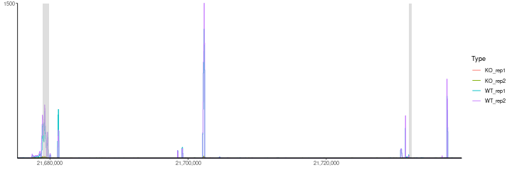
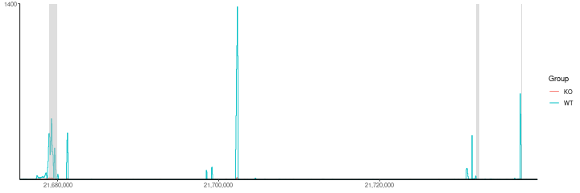
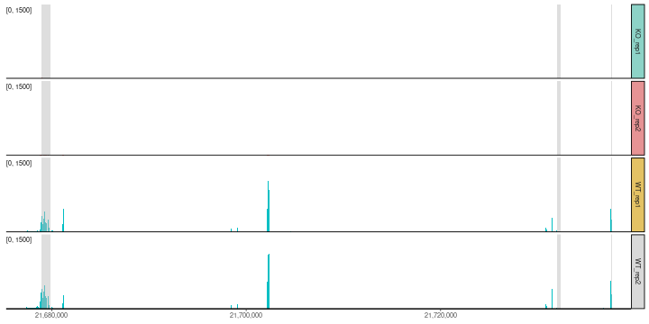
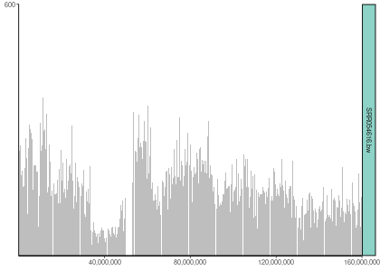
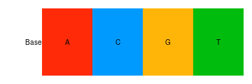
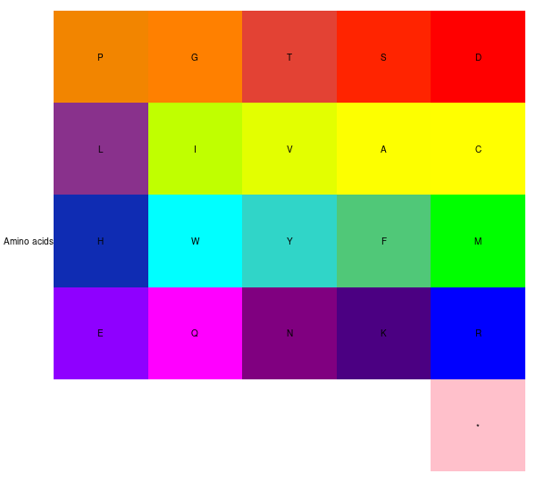
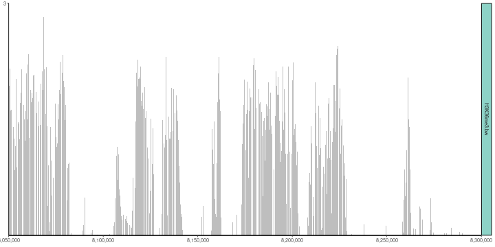

<!-- README.md is generated from README.Rmd. Please edit that file -->

# ggcoverage - Visualize and annotate genome coverage with ggplot2


[](https://cran.r-project.org/package=ggcoverage)

[](https://github.com/showteeth/ggcoverage)

## Introduction

The goal of `ggcoverage` is simplify the process of visualizing genome
coverage. It contains three main parts:

-   **Load the data**: `ggcoverage` can load BAM, BigWig (.bw), BedGraph
    files from various NGS data, including WGS, RNA-seq, ChIP-seq,
    ATAC-seq, et al.
-   **Create genome coverage plot**
-   **Add annotations**: `ggcoverage` supports six different
    annotations:
    -   **base and amino acid annotation**: Visualize genome coverage at
        single-nucleotide level with bases and amino acids.
    -   **GC annotation**: Visualize genome coverage with GC content
    -   **CNV annotation**: Visualize genome coverage with copy number
        variation (CNV)
    -   **gene annotation**: Visualize genome coverage across genes
    -   **transcription annotation**: Visualize genome coverage across
        different transcripts
    -   **ideogram annotation**: Visualize the region showing on whole
        chromosome
    -   **peak annotation**: Visualize genome coverage and peak
        identified
    -   **contact map annotation**: Visualize genome coverage with Hi-C
        contact map
    -   **link annotation**: Visualize genome coverage with contacts

`ggcoverage` utilizes `ggplot2` plotting system, so its usage is
**ggplot2-style**!

## Installation

`ggcoverage` is an R package distributed as part of the
[CRAN](https://cran.r-project.org/). To install the package, start R and
enter:

``` r
# install via CRAN
install.packages("ggcoverage")

# install via Github
# install.package("remotes")   #In case you have not installed it.
remotes::install_github("showteeth/ggcoverage")
```

In general, it is **recommended** to install from [Github
repository](https://github.com/showteeth/ggcoverage) (update more
timely).

Once `ggcoverage` is installed, it can be loaded by the following
command.

``` r
library("rtracklayer")
library("ggcoverage")
library("ggpattern")
```

## Manual

`ggcoverage` provides two
[vignettes](https://showteeth.github.io/ggcoverage/):

-   **detailed manual**: step-by-step usage
-   **customize the plot**: customize the plot and add additional layer

## RNA-seq data

### Load the data

The RNA-seq data used here are from [Transcription profiling by high
throughput sequencing of HNRNPC knockdown and control HeLa
cells](https://bioconductor.org/packages/release/data/experiment/html/RNAseqData.HNRNPC.bam.chr14.html),
we select four sample to use as example: ERR127307\_chr14,
ERR127306\_chr14, ERR127303\_chr14, ERR127302\_chr14, and all bam files
are converted to bigwig file with
[deeptools](https://deeptools.readthedocs.io/en/develop/).

Load metadata:

``` r
# load metadata
meta.file <- system.file("extdata", "RNA-seq", "meta_info.csv", package = "ggcoverage")
sample.meta = read.csv(meta.file)
sample.meta
#>        SampleName    Type Group
#> 1 ERR127302_chr14 KO_rep1    KO
#> 2 ERR127303_chr14 KO_rep2    KO
#> 3 ERR127306_chr14 WT_rep1    WT
#> 4 ERR127307_chr14 WT_rep2    WT
```

Load track files:

``` r
# track folder
track.folder = system.file("extdata", "RNA-seq", package = "ggcoverage")
# load bigwig file
track.df = LoadTrackFile(track.folder = track.folder, format = "bw",
                         region = "chr14:21,677,306-21,737,601", extend = 2000,
                         meta.info = sample.meta)
# check data
head(track.df)
#>   seqnames    start      end score    Type Group
#> 1    chr14 21675306 21675950     0 KO_rep1    KO
#> 2    chr14 21675951 21676000     1 KO_rep1    KO
#> 3    chr14 21676001 21676100     2 KO_rep1    KO
#> 4    chr14 21676101 21676150     1 KO_rep1    KO
#> 5    chr14 21676151 21677100     0 KO_rep1    KO
#> 6    chr14 21677101 21677200     2 KO_rep1    KO
```

Prepare mark region:

``` r
# create mark region
mark.region=data.frame(start=c(21678900,21732001,21737590),
                       end=c(21679900,21732400,21737650),
                       label=c("M1", "M2", "M3"))
# check data
mark.region
#>      start      end label
#> 1 21678900 21679900    M1
#> 2 21732001 21732400    M2
#> 3 21737590 21737650    M3
```

### Load GTF

To add **gene annotation**, the gtf file should contain **gene\_type**
and **gene\_name** attributes in **column 9**; to add **transcript
annotation**, the gtf file should contain **transcript\_name** attribute
in **column 9**.

``` r
gtf.file = system.file("extdata", "used_hg19.gtf", package = "ggcoverage")
gtf.gr = rtracklayer::import.gff(con = gtf.file, format = 'gtf')
```

### Basic coverage

The basic coverage plot has **two types**:

-   **facet**: Create subplot for every track (specified by
    `facet.key`). This is default.
-   **joint**: Visualize all tracks in a single plot.

#### joint view

Create line plot for **every sample** (`facet.key = "Type"`) and color
by **every sample** (`group.key = "Type"`):

``` r
basic.coverage = ggcoverage(data = track.df, color = "auto", 
                            plot.type = "joint", facet.key = "Type", group.key = "Type",
                            mark.region = mark.region, range.position = "out")
basic.coverage
```



Create **group average line plot** (sample is indicated by
`facet.key = "Type"`, group is indicated by `group.key = "Group"`):

``` r
basic.coverage = ggcoverage(data = track.df, color = "auto", 
                            plot.type = "joint", facet.key = "Type", group.key = "Group", 
                            joint.avg = TRUE,
                            mark.region = mark.region, range.position = "out")
basic.coverage
```



#### facet view

``` r
basic.coverage = ggcoverage(data = track.df, color = "auto", plot.type = "facet",
                            mark.region = mark.region, range.position = "out")
basic.coverage
```


#### Custom Y-axis style

**Change the Y-axis scale label in/out of plot region with
`range.position`**:

``` r
basic.coverage = ggcoverage(data = track.df, color = "auto", plot.type = "facet",
                            mark.region = mark.region, range.position = "in")
basic.coverage
```


**Shared/Free Y-axis scale with `facet.y.scale`**:

``` r
basic.coverage = ggcoverage(data = track.df, color = "auto", plot.type = "facet",
                            mark.region = mark.region, range.position = "in", 
                            facet.y.scale = "fixed")
basic.coverage
```



### Add gene annotation

``` r
basic.coverage + 
  geom_gene(gtf.gr=gtf.gr)
```


### Add transcript annotation

``` r
basic.coverage + 
  geom_transcript(gtf.gr=gtf.gr,label.vjust = 1.5)
```


### Add ideogram

``` r
basic.coverage +
  geom_gene(gtf.gr=gtf.gr) +
  geom_ideogram(genome = "hg19",plot.space = 0)
#> Loading ideogram...
#> Loading ranges...
#> Scale for x is already present.
#> Adding another scale for x, which will replace the existing scale.
```


``` r
basic.coverage +
  geom_transcript(gtf.gr=gtf.gr,label.vjust = 1.5) +
  geom_ideogram(genome = "hg19",plot.space = 0)
#> Loading ideogram...
#> Loading ranges...
#> Scale for x is already present.
#> Adding another scale for x, which will replace the existing scale.
```


## DNA-seq data

### CNV

#### Example 1

##### Load the data

The DNA-seq data used here are from [Copy number work
flow](http://bioconductor.org/help/course-materials/2014/SeattleOct2014/B02.2.3_CopyNumber.html),
we select tumor sample, and get bin counts with
`cn.mops::getReadCountsFromBAM` with `WL` 1000.

``` r
# prepare metafile
cnv.meta.info = data.frame(
  SampleName = c("CNV_example"),
  Type = c("tumor"),
  Group = c("tumor")
)
# track file
track.file = system.file("extdata", "DNA-seq", "CNV_example.txt", package = "ggcoverage")
# load txt file
track.df = LoadTrackFile(track.file = track.file, format = "txt", region = "chr4:61750000-62,700,000",
                         meta.info = cnv.meta.info)
# check data
head(track.df)
#>   seqnames    start      end score  Type Group
#> 1     chr4 61748000 61748000    25 tumor tumor
#> 2     chr4 61748001 61749000    24 tumor tumor
#> 3     chr4 61749001 61750000    17 tumor tumor
#> 4     chr4 61750001 61751000    23 tumor tumor
#> 5     chr4 61751001 61752000    14 tumor tumor
#> 6     chr4 61752001 61753000    22 tumor tumor
```

##### Basic coverage

``` r
basic.coverage = ggcoverage(data = track.df,color = "grey", mark.region = NULL,
                            range.position = "out")
basic.coverage
```


##### Add GC annotations

Add **GC**, **ideogram** and **gene** annotaions.

``` r
# load genome data
library("BSgenome.Hsapiens.UCSC.hg19")
#> Loading required package: BSgenome
#> Loading required package: Biostrings
#> Loading required package: XVector
#> 
#> Attaching package: 'Biostrings'
#> The following object is masked from 'package:base':
#> 
#>     strsplit
# create plot
basic.coverage +
  geom_gc(bs.fa.seq=BSgenome.Hsapiens.UCSC.hg19) +
  geom_gene(gtf.gr=gtf.gr) +
  geom_ideogram(genome = "hg19")
#> Loading ideogram...
#> Loading ranges...
#> Scale for x is already present.
#> Adding another scale for x, which will replace the existing scale.
```


#### Example 2

##### Load the data

The DNA-seq data used here are from [Genome-wide copy number analysis of
single cells](https://www.nature.com/articles/nprot.2012.039), and the
accession number is
[SRR054616](https://trace.ncbi.nlm.nih.gov/Traces/index.html?run=SRR054616).

``` r
# track file
track.file <- system.file("extdata", "DNA-seq", "SRR054616.bw", package = "ggcoverage")
# load track
track.df = LoadTrackFile(track.file = track.file, format = "bw", region = "4:1-160000000")
#> Sample without metadata!
# add chr prefix
track.df$seqnames = paste0("chr", track.df$seqnames)
# check data
head(track.df)
#>   seqnames  start    end score         Type        Group
#> 1     chr4      1  50000   197 SRR054616.bw SRR054616.bw
#> 2     chr4  50001 100000   598 SRR054616.bw SRR054616.bw
#> 3     chr4 100001 150000   287 SRR054616.bw SRR054616.bw
#> 4     chr4 150001 200000   179 SRR054616.bw SRR054616.bw
#> 5     chr4 200001 250000   282 SRR054616.bw SRR054616.bw
#> 6     chr4 250001 300000   212 SRR054616.bw SRR054616.bw
```

##### Basic coverage

``` r
basic.coverage = ggcoverage(data = track.df, color = "grey",
                            mark.region = NULL, range.position = "out")
basic.coverage
```



##### Load CNV file

``` r
# prepare files
cnv.file <- system.file("extdata", "DNA-seq", "SRR054616_copynumber.txt", package = "ggcoverage")
# read CNV
cnv.df = read.table(file = cnv.file, sep = "\t", header = TRUE)
# check data
head(cnv.df)
#>   chrom chrompos  cn.ratio copy.number
#> 1  chr4        1 11.518554           5
#> 2  chr4    90501  5.648878           5
#> 3  chr4   145220  4.031609           5
#> 4  chr4   209519  5.005852           5
#> 5  chr4   268944  4.874096           5
#> 6  chr4   330272  4.605368           5
```

##### Add annotations

Add **GC**, **ideogram** and **CNV** annotations.

``` r
# load genome data
library("BSgenome.Hsapiens.UCSC.hg19")
# create plot
basic.coverage +
  geom_gc(bs.fa.seq=BSgenome.Hsapiens.UCSC.hg19) +
  geom_cnv(cnv.df = cnv.df, bin.col = 3, cn.col = 4) +
  geom_ideogram(genome = "hg19",plot.space = 0, highlight.centromere = TRUE)
#> Loading ideogram...
#> Loading ranges...
#> Scale for x is already present.
#> Adding another scale for x, which will replace the existing scale.
```


### Single-nucleotide level

#### Load the data

``` r
# prepare sample metadata
sample.meta <- data.frame(
  SampleName = c("tumorA.chr4.selected"),
  Type = c("tumorA"),
  Group = c("tumorA")
)
# load bam file
bam.file = system.file("extdata", "DNA-seq", "tumorA.chr4.selected.bam", package = "ggcoverage")
track.df <- LoadTrackFile(
  track.file = bam.file,
  meta.info = sample.meta,
  single.nuc=TRUE, single.nuc.region="chr4:62474235-62474295"
)
head(track.df)
#>   seqnames    start      end score   Type  Group
#> 1     chr4 62474235 62474236     5 tumorA tumorA
#> 2     chr4 62474236 62474237     5 tumorA tumorA
#> 3     chr4 62474237 62474238     5 tumorA tumorA
#> 4     chr4 62474238 62474239     6 tumorA tumorA
#> 5     chr4 62474239 62474240     6 tumorA tumorA
#> 6     chr4 62474240 62474241     6 tumorA tumorA
```

#### Default color scheme

For base and amino acid annotation, we have following default color
schemes, you can change with `nuc.color` and `aa.color` parameters.

Default color scheme for base annotation is `Clustal-style`, more
popular color schemes is available
[here](https://www.biostars.org/p/171056/).

``` r
# color scheme
nuc.color = c("A" = "#ff2b08", "C" = "#009aff", "G" = "#ffb507", "T" = "#00bc0d")
opar <- graphics::par() 
# create plot
graphics::par(mar = c(1, 5, 1, 1))
graphics::image(
  1:length(nuc.color), 1, as.matrix(1:length(nuc.color)),
  col = nuc.color,
  xlab = "", ylab = "", xaxt = "n", yaxt = "n", bty = "n"
)
graphics::text(1:length(nuc.color), 1, names(nuc.color))
graphics::mtext(
  text = "Base", adj = 1, las = 1,
  side = 2
)
```



``` r
# reset par default
graphics::par(opar)
```

Default color scheme for amino acid annotation is from [Residual
colours: a proposal for
aminochromography](https://academic.oup.com/peds/article/10/7/743/1593029?login=false):

``` r
aa.color = c(
  "D" = "#FF0000", "S" = "#FF2400", "T" = "#E34234", "G" = "#FF8000", "P" = "#F28500",
  "C" = "#FFFF00", "A" = "#FDFF00", "V" = "#E3FF00", "I" = "#C0FF00", "L" = "#89318C",
  "M" = "#00FF00", "F" = "#50C878", "Y" = "#30D5C8", "W" = "#00FFFF", "H" = "#0F2CB3",
  "R" = "#0000FF", "K" = "#4b0082", "N" = "#800080", "Q" = "#FF00FF", "E" = "#8F00FF",
  "*" = "#FFC0CB", " " = "#FFFFFF", " " = "#FFFFFF", " " = "#FFFFFF", " " = "#FFFFFF"
)

graphics::par(mar = c(1, 5, 1, 1))
graphics::image(
  1:5, 1:5, matrix(1:length(aa.color),nrow=5),
  col = rev(aa.color),
  xlab = "", ylab = "", xaxt = "n", yaxt = "n", bty = "n"
)
graphics::text(expand.grid(1:5,1:5), names(rev(aa.color)))
graphics::mtext(
  text = "Amino acids", adj = 1, las = 1,
  side = 2
)
```



``` r
# reset par default
graphics::par(opar)
```

#### Add base and amino acid annotation

**Use twill to mark position with SNV**:

``` r
library(ggpattern)
# create plot with twill mark
ggcoverage(data = track.df, color = "grey", range.position = "out", 
           single.nuc=T, rect.color = "white") +
  geom_base(bam.file = bam.file,
            bs.fa.seq = BSgenome.Hsapiens.UCSC.hg19,
            mark.type = "twill") +
  geom_ideogram(genome = "hg19",plot.space = 0)
#> Loading ideogram...
#> Loading ranges...
#> Scale for x is already present.
#> Adding another scale for x, which will replace the existing scale.
```


**Use star to mark position with SNV**:

``` r
# create plot with star mark
ggcoverage(data = track.df, color = "grey", range.position = "out", 
           single.nuc=T, rect.color = "white") +
  geom_base(bam.file = bam.file,
            bs.fa.seq = BSgenome.Hsapiens.UCSC.hg19,
            mark.type = "star") +
  geom_ideogram(genome = "hg19",plot.space = 0)
#> Loading ideogram...
#> Loading ranges...
#> Scale for x is already present.
#> Adding another scale for x, which will replace the existing scale.
```


**Highlight position with SNV**:

``` r
# highlight
ggcoverage(data = track.df, color = "grey", range.position = "out", 
           single.nuc=T, rect.color = "white") +
  geom_base(bam.file = bam.file,
            bs.fa.seq = BSgenome.Hsapiens.UCSC.hg19,
            mark.type = "highlight") +
  geom_ideogram(genome = "hg19",plot.space = 0)
#> Loading ideogram...
#> Loading ranges...
#> Scale for x is already present.
#> Adding another scale for x, which will replace the existing scale.
```


## ChIP-seq data

The ChIP-seq data used here are from
[DiffBind](https://bioconductor.org/packages/release/bioc/html/DiffBind.html),
I select four sample to use as example: Chr18\_MCF7\_input,
Chr18\_MCF7\_ER\_1, Chr18\_MCF7\_ER\_3, Chr18\_MCF7\_ER\_2, and all bam
files are converted to bigwig file with
[deeptools](https://deeptools.readthedocs.io/en/develop/).

Create metadata:

``` r
# load metadata
sample.meta = data.frame(SampleName=c('Chr18_MCF7_ER_1','Chr18_MCF7_ER_2','Chr18_MCF7_ER_3','Chr18_MCF7_input'),
                         Type = c("MCF7_ER_1","MCF7_ER_2","MCF7_ER_3","MCF7_input"),
                         Group = c("IP", "IP", "IP", "Input"))
sample.meta
#>         SampleName       Type Group
#> 1  Chr18_MCF7_ER_1  MCF7_ER_1    IP
#> 2  Chr18_MCF7_ER_2  MCF7_ER_2    IP
#> 3  Chr18_MCF7_ER_3  MCF7_ER_3    IP
#> 4 Chr18_MCF7_input MCF7_input Input
```

Load track files:

``` r
# track folder
track.folder = system.file("extdata", "ChIP-seq", package = "ggcoverage")
# load bigwig file
track.df = LoadTrackFile(track.folder = track.folder, format = "bw", region = "chr18:76822285-76900000",
                         meta.info = sample.meta)
# check data
head(track.df)
#>   seqnames    start      end      score      Type Group
#> 1    chr18 76820285 76820400 219.658005 MCF7_ER_1    IP
#> 2    chr18 76820401 76820700   0.000000 MCF7_ER_1    IP
#> 3    chr18 76820701 76821000 439.316010 MCF7_ER_1    IP
#> 4    chr18 76821001 76821300 219.658005 MCF7_ER_1    IP
#> 5    chr18 76821301 76821600   0.000000 MCF7_ER_1    IP
#> 6    chr18 76821601 76821900 219.658005 MCF7_ER_1    IP
```

Prepare mark region:

``` r
# create mark region
mark.region=data.frame(start=c(76822533),
                       end=c(76823743),
                       label=c("Promoter"))
# check data
mark.region
#>      start      end    label
#> 1 76822533 76823743 Promoter
```

### Basic coverage

``` r
basic.coverage = ggcoverage(data = track.df, color = "auto", 
                            mark.region=mark.region, show.mark.label = FALSE)
basic.coverage
```


### Add annotations

Add **gene**, **ideogram** and **peak** annotations. To create peak
annotation, we first **get consensus peaks** with
[MSPC](https://github.com/Genometric/MSPC).

``` r
# get consensus peak file
peak.file = system.file("extdata", "ChIP-seq", "consensus.peak", package = "ggcoverage")

basic.coverage +
  geom_gene(gtf.gr=gtf.gr) +
  geom_peak(bed.file = peak.file) +
  geom_ideogram(genome = "hg19",plot.space = 0)
#> Loading ideogram...
#> Loading ranges...
#> Scale for x is already present.
#> Adding another scale for x, which will replace the existing scale.
```


## Hi-C data

The Hi-C data are from [pyGenomeTracks: reproducible plots for
multivariate genomic
datasets](https://academic.oup.com/bioinformatics/article/37/3/422/5879987?login=false).

The Hi-C matrix visualization is implemented by
[HiCBricks](https://github.com/koustav-pal/HiCBricks).

### Load track data

``` r
library(ggcoverage)
library(GenomicRanges)
# prepare track dataframe
track.file = system.file("extdata", "HiC", "H3K36me3.bw", package = "ggcoverage")
track.df = LoadTrackFile(track.file = track.file, format = "bw", 
                         region = "chr2L:8050000-8300000", extend = 0)
#> Sample without metadata!
track.df$score = ifelse(track.df$score <0, 0, track.df$score)
# check the data
head(track.df)
#>   seqnames   start     end      score        Type       Group
#> 1    chr2L 8050000 8050009 1.66490245 H3K36me3.bw H3K36me3.bw
#> 2    chr2L 8050015 8050049 1.59976900 H3K36me3.bw H3K36me3.bw
#> 3    chr2L 8050057 8050091 1.60730922 H3K36me3.bw H3K36me3.bw
#> 4    chr2L 8050097 8050131 1.65555012 H3K36me3.bw H3K36me3.bw
#> 5    chr2L 8050137 8050171 1.71025538 H3K36me3.bw H3K36me3.bw
#> 6    chr2L 8050176 8050210 1.75198197 H3K36me3.bw H3K36me3.bw
```

### Load Hi-C data

Matrix:

``` r
## matrix
hic.mat.file = system.file("extdata", "HiC", "HiC_mat.txt", package = "ggcoverage")
hic.mat = read.table(file = hic.mat.file, sep = "\t")
hic.mat = as.matrix(hic.mat)
```

Bin table:

``` r
## bin
hic.bin.file = system.file("extdata", "HiC", "HiC_bin.txt", package = "ggcoverage")
hic.bin = read.table(file = hic.bin.file, sep = "\t")
colnames(hic.bin) = c("chr", "start", "end")
hic.bin.gr = GenomicRanges::makeGRangesFromDataFrame(df = hic.bin)
## transfrom func
FailSafe_log10 <- function(x){
  x[is.na(x) | is.nan(x) | is.infinite(x)] <- 0
  return(log10(x+1))
}
```

Data transfromation method:

``` r
## transfrom func
FailSafe_log10 <- function(x){
  x[is.na(x) | is.nan(x) | is.infinite(x)] <- 0
  return(log10(x+1))
}
```

### Load link

``` r
# prepare arcs
link.file = system.file("extdata", "HiC", "HiC_link.bedpe", package = "ggcoverage")
```

### Basic coverage

``` r
basic.coverage = ggcoverage(data = track.df, color = "grey",
                            mark.region = NULL, range.position = "out")
basic.coverage
```



### Add annotations

Add **link**, **contact map**annotations:

``` r
basic.coverage +
  geom_tad(matrix = hic.mat, granges = hic.bin.gr, value.cut = 0.99,
           color.palette = "viridis", transform.fun = FailSafe_log10,
           top = FALSE, show.rect = TRUE) +
  geom_link(link.file = link.file, file.type = "bedpe", show.rect = TRUE)
#> Read 534 lines after Skipping 0 lines
#> Inserting Data at location: 1
#> Data length: 534
#> Loaded 2315864 bytes of data...
#> Read 534 records...
#> Scale for y is already present.
#> Adding another scale for y, which will replace the existing scale.
#> Scale for x is already present.
#> Adding another scale for x, which will replace the existing scale.
```


## Code of Conduct

Please note that the `ggcoverage` project is released with a
[Contributor Code of
Conduct](https://contributor-covenant.org/version/2/0/CODE_OF_CONDUCT.html).
By contributing to this project, you agree to abide by its terms.
