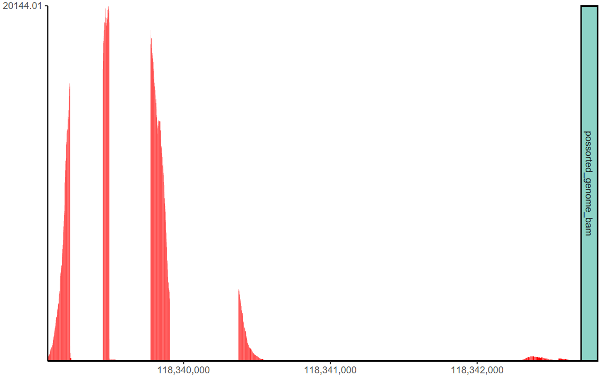

```{r setup, include=FALSE}
knitr::opts_chunk$set(echo = TRUE)
```

## Introduction
For large track files, it's usually time and memory consuming to create coverage plot. `ggcoverage` provides two memory and time-efficient ways:

* For **bigwig files** and **bam files that do not require normalization**: `ggcoverage` loads the visualized region specified by users **instead of** loading the whole files and then extracting the visualized region.
* For **bam files that require normalization**: `ggcoverage` utilizes [BiocParallel](https://bioconductor.org/packages/release/bioc/html/BiocParallel.html) to **perform normalization parallelly**.

<hr />

## Load region
### Test data
Here, we will load a big BAM file (~27G) from 10x single cell RNA-seq:
```{bash big_bam, eval=FALSE}
ls -lh possorted_genome_bam.bam

#> -rw-r--r--. 1 songyabing wanglab 27G 8月  31 2021 possorted_genome_bam.bam
```

<hr />

### Load region
```{r big_bam_load}
library(ggcoverage)

# prepare metadata
sample.meta <- data.frame(
  SampleName = c("possorted_genome_bam"),
  Type = c("possorted_genome_bam"),
  Group = c("10x")
)
sample.meta
# prepare track folder
track.folder <- "~/projects/ggcoverage"
# load the track
# region length: 3631
system.time(track.df <- LoadTrackFile(
  track.folder = track.folder, format = "bam", norm.method = "None",
  region = "chr11:118339075-118342705",
  extend = 0, meta.info = sample.meta
))
```

check the data:
```{r big_bam_load2}
head(track.df)
```

For larger region:
```{r big_bam_load3}
# region length: 203631
system.time(LoadTrackFile(
  track.folder = track.folder, format = "bam", norm.method = "None",
  region = "chr11:118339075-118542705",
  extend = 0, meta.info = sample.meta
))
```

<hr />

### Create coverage
With the track dataframe, we can generate coverage plot.
```{r big_bam_coverage_time}
# create basic coverage plot
# the running time is very small
system.time(basic.coverage <- ggcoverage(
  data = track.df, color = "red",
  range.position = "out", show.mark.label = FALSE
))
```

The coverage plot (the bars are relatively dense, and can be viewed more clearly when saved as a PDF):
```{r big_bam_coverage_plot, echo=FALSE, fig.height = 6, fig.width = 12, fig.align = "center"}

```

<hr />

## Parallel normalization

### Test data
To test the perfromance, we use three identical bam files from [SRR053616](https://trace.ncbi.nlm.nih.gov/Traces/?run=SRR053616).

Data folder for **sequential normalization**:
```{bash sequential_norm_data, eval=FALSE}
# test the sequential normalization
ls -lh ./test

#> total 2.0G
#> -rw-r--r--. 1 songyabing wanglab 3.9M May  26 16:44 SRR054616_rep3.bam.bai
#> -rw-r--r--. 1 songyabing wanglab 3.9M May  26 16:44 SRR054616_rep2.bam.bai
#> -rw-r--r--. 1 songyabing wanglab 3.9M May  26 16:44 SRR054616_rep1.bam.bai
#> -rw-r--r--. 1 songyabing wanglab 646M May  26 16:44 SRR054616_rep3.bam
#> -rw-r--r--. 1 songyabing wanglab 646M May  26 16:44 SRR054616_rep2.bam
#> -rw-r--r--. 1 songyabing wanglab 646M May  26 16:44 SRR054616_rep1.bam
```

Data folder for **parallel normalization**:
```{bash parallel_norm_data, eval=FALSE}
# test the parallel normalization
ls -lh ./test2

#> total 2.0G
#> -rw-r--r--. 1 songyabing wanglab 3.9M May  26 16:44 SRR054616_rep3.bam.bai
#> -rw-r--r--. 1 songyabing wanglab 3.9M May  26 16:44 SRR054616_rep2.bam.bai
#> -rw-r--r--. 1 songyabing wanglab 3.9M May  26 16:44 SRR054616_rep1.bam.bai
#> -rw-r--r--. 1 songyabing wanglab 646M May  26 16:44 SRR054616_rep3.bam
#> -rw-r--r--. 1 songyabing wanglab 646M May  26 16:44 SRR054616_rep2.bam
#> -rw-r--r--. 1 songyabing wanglab 646M May  26 16:44 SRR054616_rep1.bam
```

<hr />

### Sequential normalization
```{r sequential_norm, eval=FALSE}
# prepare sample metadata
sample.meta <- data.frame(
  SampleName = c("SRR054616_rep1", "SRR054616_rep2", "SRR054616_rep3"),
  Type = c("SRR054616_rep1", "SRR054616_rep2", "SRR054616_rep3"),
  Group = c("rep1", "rep2", "rep3")
)
sample.meta

# track folder
track.folder <- "./test"

# run
system.time(track.df <- LoadTrackFile(
  track.folder = track.folder, format = "bam", norm.method = "RPKM",
  region = "14:21,677,306-21,737,601", bamcoverage.path = "~/anaconda3/bin/bamCoverage",
  extend = 2000, meta.info = sample.meta
))

#> user       system elapsed
#> 1169.767   35.005 1208.704
```

The **elapsed** time (unit: seconds) is the time spent from the start to the end of the command. 

<hr />

### Parallel normalization
```{r parallel_norm, eval=FALSE}
# prepare sample metadata
sample.meta <- data.frame(
  SampleName = c("SRR054616_rep1", "SRR054616_rep2", "SRR054616_rep3"),
  Type = c("SRR054616_rep1", "SRR054616_rep2", "SRR054616_rep3"),
  Group = c("rep1", "rep2", "rep3")
)
sample.meta

# track folder
track.folder <- "./test2"

# run with three cores
system.time(track.df <- LoadTrackFile(
  track.folder = track.folder, format = "bam", norm.method = "RPKM",
  region = "14:21,677,306-21,737,601", bamcoverage.path = "~/anaconda3/bin/bamCoverage",
  extend = 2000, meta.info = sample.meta, n.cores = 3
))

#> user       system  elapsed
#> 1191.628   36.818  424.143
```

<mark>Here we can see, the time spent in parallel normalization is nearly one-third that of sequential normalization.</mark>

<hr />

### Create coverage
In general, the loading step is the most time-consuming step. With the track dataframe, we can generate coverage plot.
```{r parallel_coverage_time}
# read the track dataframe
track.df <- utils::read.table(
  file = "~/projects/ggcoverage/ggcoverage_parallel_track.txt",
  sep = "\t", header = T
)
# create basic coverage plot
# the running time is very small
system.time(basic.coverage <- ggcoverage(
  data = track.df, color = "auto",
  range.position = "out", show.mark.label = FALSE
))
```

The coverage plot:
```{r parallel_coverage_plot, echo=FALSE, fig.height = 6, fig.width = 12, fig.align = "center"}
basic.coverage
```


