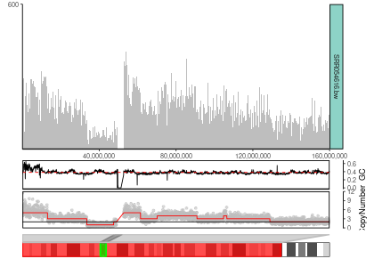
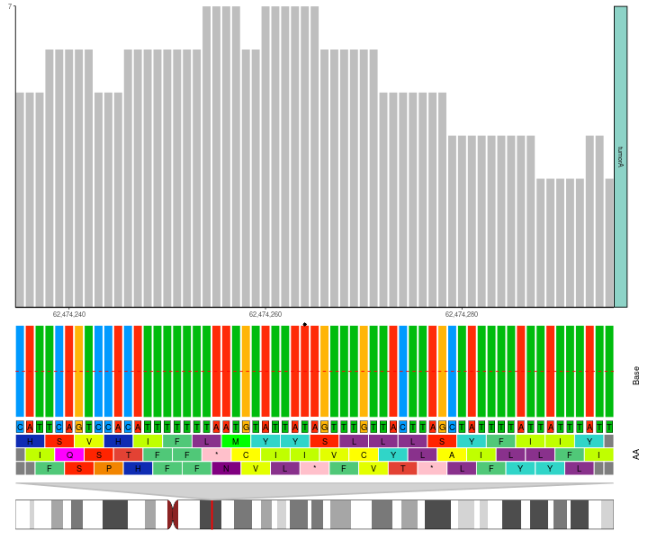
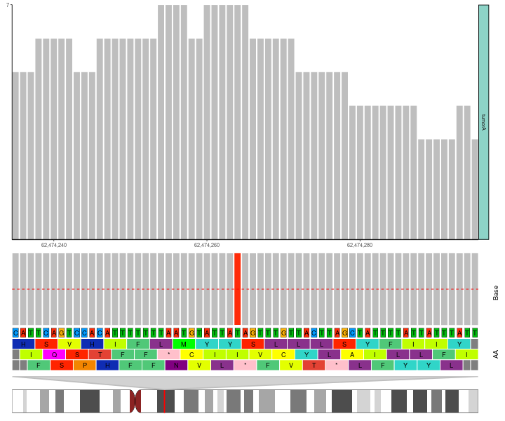
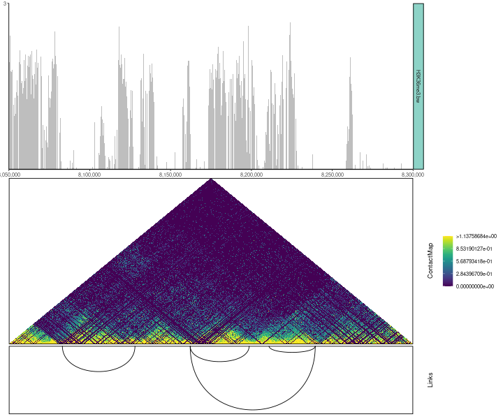
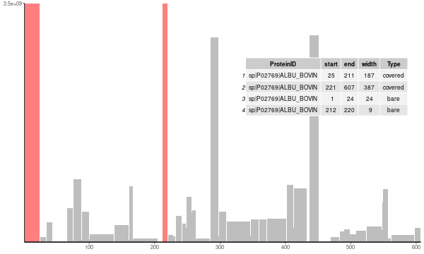
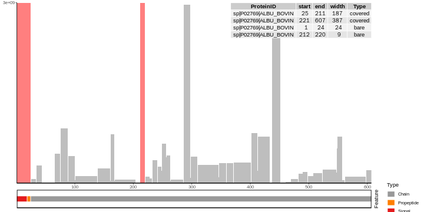

  
```{r style, echo = FALSE, results = 'asis'}
BiocStyle::markdown()
```

```{r setup, echo=FALSE, warning = FALSE}
knitr::opts_chunk$set(
  collapse = TRUE,
  comment = "#>",
  dpi = 60,
  fig.path = "png/",
  crop = NULL
)
```

## Introduction

The goal of `ggcoverage` is simplify the process of visualizing omics coverage. It contains three main parts:

* **Load the data**: `ggcoverage` can load BAM, BigWig (.bw), BedGraph, txt/xlsx files from various omics data, including WGS, RNA-seq, ChIP-seq, ATAC-seq, proteomics, et al.
* **Create omics coverage plot**
* **Add annotations**: `ggcoverage` supports six different annotations:
  * **base and amino acid annotation**: Visualize genome coverage at single-nucleotide level with bases and amino acids.
  * **GC annotation**: Visualize genome coverage with GC content
  * **CNV annotation**: Visualize genome coverage with copy number variation (CNV)
  * **gene annotation**: Visualize genome coverage across genes
  * **transcription annotation**: Visualize genome coverage across different transcripts
  * **ideogram annotation**: Visualize the region showing on whole chromosome
  * **peak annotation**: Visualize genome coverage and peak identified
  * **contact map annotation**: Visualize genome coverage with Hi-C contact map
  * **link annotation**: Visualize genome coverage with contacts
  * **protein feature annotation**: Visualize protein coverage with features

`ggcoverage` utilizes `ggplot2` plotting system, so its usage is **ggplot2-style**!


## Installation

`ggcoverage` is an R package distributed as part of the [CRAN](https://cran.r-project.org/).
To install the package, start R and enter one of the following commands:
  
```{r install, eval=FALSE}
# install via CRAN (not yet available)
install.packages("ggcoverage")

# OR install via Github
install.package("remotes")
remotes::install_github("showteeth/ggcoverage")
```

In general, it is **recommended** to install from [Github repository](https://github.com/showteeth/ggcoverage) (update more timely).

Once `ggcoverage` is installed, it can be loaded (together with other libraries) like this:

```{r library, message=FALSE, warning = FALSE}
library("rtracklayer")
library("ggcoverage")
library("ggpattern")
```

## Manual

`ggcoverage` provides two [vignettes](https://showteeth.github.io/ggcoverage/): 

* **detailed manual**: step-by-step usage
* **customize the plot**: customize the plot and add additional layer


## RNA-seq data

### Load the data

The RNA-seq data used here are from [Transcription profiling by high throughput sequencing of HNRNPC knockdown and control HeLa cells](https://bioconductor.org/packages/release/data/experiment/html/RNAseqData.HNRNPC.bam.chr14.html), we select four sample to use as example: ERR127307_chr14, ERR127306_chr14, ERR127303_chr14, ERR127302_chr14, and all bam files are converted to bigwig file with [deeptools](https://deeptools.readthedocs.io/en/develop/).

Load metadata:

```{r load_metadata}
# load metadata
meta_file <-
  system.file("extdata", "RNA-seq", "meta_info.csv", package = "ggcoverage")
sample_meta <- read.csv(meta_file)
sample_meta
```

Load track files:

```{r load_track}
# track folder
track_folder <- system.file("extdata", "RNA-seq", package = "ggcoverage")
# load bigwig file
track_df <- LoadTrackFile(
  track.folder = track_folder,
  format = "bw",
  region = "chr14:21,677,306-21,737,601",
  extend = 2000,
  meta.info = sample_meta
)
# check data
head(track_df)
```

Prepare mark region:

```{r prepare_mark}
# create mark region
mark_region <- data.frame(
  start = c(21678900, 21732001, 21737590),
  end = c(21679900, 21732400, 21737650),
  label = c("M1", "M2", "M3")
)
# check data
mark_region
```

### Load GTF

To add **gene annotation**, the gtf file should contain **gene_type** and **gene_name** attributes in **column 9**; to add **transcript annotation**, the gtf file should contain **transcript_name** attribute in **column 9**.

```{r load_gtf}
gtf_file <-
  system.file("extdata", "used_hg19.gtf", package = "ggcoverage")
gtf_gr <- rtracklayer::import.gff(con = gtf_file, format = "gtf")
```

### Basic coverage

The basic coverage plot has **two types**: 

* **facet**: Create subplot for every track (specified by `facet.key`). This is default.
* **joint**: Visualize all tracks in a single plot.

#### joint view

Create line plot for **every sample** (`facet.key = "Type"`) and color by **every sample** (`group.key = "Type"`):

```{r basic_coverage_joint, warning = FALSE, fig.height = 4, fig.width = 12, fig.align = "center"}
basic_coverage <- ggcoverage(
  data = track_df,
  plot.type = "joint",
  facet.key = "Type",
  group.key = "Type",
  mark.region = mark_region,
  range.position = "out"
)

basic_coverage
```

Create **group average line plot** (sample is indicated by `facet.key = "Type"`, group is indicated by `group.key = "Group"`):

```{r basic_coverage_joint_avg, warning = FALSE, fig.height = 4, fig.width = 12, fig.align = "center"}
basic_coverage <- ggcoverage(
  data = track_df,
  plot.type = "joint",
  facet.key = "Type",
  group.key = "Group",
  joint.avg = TRUE,
  mark.region = mark_region,
  range.position = "out"
)

basic_coverage
```

#### Facet view

```{r basic_coverage, warning = FALSE, fig.height = 6, fig.width = 12, fig.align = "center"}
basic_coverage <- ggcoverage(
  data = track_df,
  plot.type = "facet",
  mark.region = mark_region,
  range.position = "out"
)

basic_coverage
```

#### Custom Y-axis style

**Change the Y-axis scale label in/out of plot region with `range.position`**:

```{r basic_coverage_2, warning = FALSE, fig.height = 6, fig.width = 12, fig.align = "center"}
basic_coverage <- ggcoverage(
  data = track_df,
  plot.type = "facet",
  mark.region = mark_region,
  range.position = "in"
)

basic_coverage
```

**Shared/Free Y-axis scale with `facet.y.scale`**:

```{r basic_coverage_3, warning = FALSE, fig.height = 6, fig.width = 12, fig.align = "center"}
basic_coverage <- ggcoverage(
  data = track_df,
  plot.type = "facet",
  mark.region = mark_region,
  range.position = "in",
  facet.y.scale = "fixed"
)

basic_coverage
```

### Add gene annotation

- default behavior is to draw genes (transcripts), exons and UTRs with different line width
- can bec adjusted using `gene.size`, `exon.size` and `utr.size` parameters
- frequency of intermittent arrows (light color) can be adjusted using the `arrow.num` and `arrow.gap` parameters
- genomic features are colored by `strand` by default, which can be changed using the `color.by` parameter

```{r gene_coverage, warning = FALSE, fig.height = 8, fig.width = 12, fig.align = "center"}
basic_coverage +
  geom_gene(gtf.gr = gtf_gr)
```


### Add transcript annotation

**In "loose" stype (default style; each transcript occupies one line)**:

```{r transcript_coverage, warning = FALSE, fig.height = 12, fig.width = 12, fig.align = "center"}
basic_coverage +
  geom_transcript(gtf.gr = gtf_gr, label.vjust = 1.5)
```

**In "tight" style (place non-overlap transcripts in one line)**:

```{r transcript_coverage_tight, warning = FALSE, fig.height = 12, fig.width = 12, fig.align = "center"}
basic_coverage +
  geom_transcript(gtf.gr = gtf_gr,
                  overlap.style = "tight",
                  label.vjust = 1.5)
```

### Add ideogram

```{r ideogram_coverage_1, eval = FALSE}
basic_coverage +
  geom_gene(gtf.gr = gtf_gr) +
  geom_ideogram(genome = "hg19", plot.space = 0)
```

```{r ideogram_coverage_1_plot, echo = FALSE, fig.height = 10, fig.width = 12, fig.align = "center"}
knitr::include_graphics("../man/figures/README-ideogram_coverage_1-1.png")
```

```{r ideogram_coverage_2, eval = FALSE}
basic_coverage +
  geom_transcript(gtf.gr = gtf_gr, label.vjust = 1.5) +
  geom_ideogram(genome = "hg19", plot.space = 0)
```

```{r ideogram_coverage_2_plot, echo = FALSE, fig.height = 14, fig.width = 12, fig.align = "center"}
knitr::include_graphics("../man/figures/README-ideogram_coverage_2-1.png")
```

## DNA-seq data

### CNV

#### Example 1

##### Load the data

The DNA-seq data used here are from [Copy number work flow](https://bioconductor.org/help/course-materials/2014/SeattleOct2014/B02.2.3_CopyNumber.html), we select tumor sample, and get bin counts with `cn.mops::getReadCountsFromBAM` with `WL` 1000.

```{r load_bin_counts}
# prepare metafile
cnv_meta_info <- data.frame(
  SampleName = c("CNV_example"),
  Type = c("tumor"),
  Group = c("tumor")
)

# track file
track_file <- system.file("extdata",
                          "DNA-seq", "CNV_example.txt", package = "ggcoverage")

# load txt file
track_df <- LoadTrackFile(
  track.file = track_file,
  format = "txt",
  region = "chr4:61750000-62,700,000",
  meta.info = cnv_meta_info
)

# check data
head(track_df)
```

##### Basic coverage

```{r basic_coverage_dna, warning = FALSE, fig.height = 6, fig.width = 12, fig.align = "center"}
basic_coverage <- ggcoverage(
  data = track_df,
  color = "grey",
  mark.region = NULL,
  range.position = "out"
)

basic_coverage
```

##### Add GC annotations

Add **GC**, **ideogram** and **gene** annotaions.

```{r gc_coverage, eval = FALSE}
# load genome data
library("BSgenome.Hsapiens.UCSC.hg19")

# create plot
basic_coverage +
  geom_gc(bs.fa.seq = BSgenome.Hsapiens.UCSC.hg19) +
  geom_gene(gtf.gr = gtf_gr) +
  geom_ideogram(genome = "hg19")
```


```{r gc_coverage_plot, echo = FALSE, fig.height = 10, fig.width = 12, fig.align = "center"}
knitr::include_graphics("../man/figures/README-gc_coverage-1.png")
```

#### Example 2

##### Load the data

The DNA-seq data used here are from [Genome-wide copy number analysis of single cells](https://www.nature.com/articles/nprot.2012.039), and the accession number is [SRR054616](https://trace.ncbi.nlm.nih.gov/Traces/index.html?run=SRR054616).

```{r cnv_load_track_file}
# track file
track_file <-
  system.file("extdata", "DNA-seq", "SRR054616.bw", package = "ggcoverage")

# load track
track_df <- LoadTrackFile(track.file = track_file,
                          format = "bw",
                          region = "4:1-160000000")

# add chr prefix
track_df$seqnames <- paste0("chr", track_df$seqnames)

# check data
head(track_df)
```

##### Basic coverage

```{r cnv_basic_coverage_dna}
basic_coverage <- ggcoverage(
  data = track_df,
  color = "grey",
  mark.region = NULL,
  range.position = "out"
)

basic_coverage
```

##### Load CNV file

```{r cnv_load_cnv}
# prepare files
cnv_file <-
  system.file("extdata", "DNA-seq", "SRR054616_copynumber.txt",
              package = "ggcoverage")

# read CNV
cnv_df <- read.table(file = cnv_file, sep = "\t", header = TRUE)

# check data
head(cnv_df)
```

##### Add annotations

Add **GC**, **ideogram** and **CNV** annotations.

```{r cnv_gc_coverage, eval=FALSE}
# create plot
basic_coverage +
  geom_gc(bs.fa.seq = BSgenome.Hsapiens.UCSC.hg19) +
  geom_cnv(cnv.df = cnv_df,
           bin.col = 3,
           cn.col = 4) +
  geom_ideogram(
    genome = "hg19",
    plot.space = 0,
    highlight.centromere = TRUE
  )
```

```{r cnv_gc_coverage_plot, echo = FALSE, fig.height = 10, fig.width = 12, fig.align = "center"}

```


### Single-nucleotide level

#### Load the data

```{r load_single_nuc}
# prepare sample metadata
sample_meta <- data.frame(
  SampleName = c("tumorA.chr4.selected"),
  Type = c("tumorA"),
  Group = c("tumorA")
)

# load bam file
bam_file <- system.file("extdata",
                        "DNA-seq", "tumorA.chr4.selected.bam",
                        package = "ggcoverage")

track_df <- LoadTrackFile(
  track.file = bam_file,
  meta.info = sample_meta,
  single.nuc = TRUE,
  single.nuc.region = "chr4:62474235-62474295"
)

head(track_df)
```

#### Default color scheme

For base and amino acid annotation, we have following default color schemes, you can change with `nuc.color` and `aa.color` parameters.

Default color scheme for base annotation is `Clustal-style`, more popular color schemes is available [here](https://www.biostars.org/p/171056/).

```{r base_color_scheme, warning = FALSE, fig.height = 2, fig.width = 6, fig.align = "center"}
# color scheme
nuc_color <- c(
  "A" = "#ff2b08", "C" = "#009aff", "G" = "#ffb507", "T" = "#00bc0d"
)
opar <- graphics::par()

# create plot
graphics::par(mar = c(1, 5, 1, 1))
graphics::image(
  seq_along(nuc_color),
  1,
  as.matrix(seq_along(nuc_color)),
  col = nuc_color,
  xlab = "",
  ylab = "",
  xaxt = "n",
  yaxt = "n",
  bty = "n"
)
graphics::text(seq_along(nuc_color), 1, names(nuc_color))
graphics::mtext(
  text = "Base",
  adj = 1,
  las = 1,
  side = 2
)

# reset par default
graphics::par(opar)
```

Default color scheme for amino acid annotation is from [Residual colours: a proposal for aminochromography](https://academic.oup.com/peds/article/10/7/743/1593029?login=false):

```{r aa_color_scheme, warning = FALSE, fig.height = 9, fig.width = 10, fig.align = "center"}
aa_color <- c(
  "D" = "#FF0000", "S" = "#FF2400", "T" = "#E34234", "G" = "#FF8000",
  "P" = "#F28500", "C" = "#FFFF00", "A" = "#FDFF00", "V" = "#E3FF00",
  "I" = "#C0FF00", "L" = "#89318C", "M" = "#00FF00", "F" = "#50C878",
  "Y" = "#30D5C8", "W" = "#00FFFF", "H" = "#0F2CB3", "R" = "#0000FF",
  "K" = "#4b0082", "N" = "#800080", "Q" = "#FF00FF", "E" = "#8F00FF",
  "*" = "#FFC0CB", " " = "#FFFFFF", " " = "#FFFFFF", " " = "#FFFFFF",
  " " = "#FFFFFF"
)

graphics::par(mar = c(1, 5, 1, 1))
graphics::image(
  1:5,
  1:5,
  matrix(seq_along(aa_color), nrow = 5),
  col = rev(aa_color),
  xlab = "",
  ylab = "",
  xaxt = "n",
  yaxt = "n",
  bty = "n"
)

graphics::text(expand.grid(1:5, 1:5), names(rev(aa_color)))
graphics::mtext(
  text = "Amino acids",
  adj = 1,
  las = 1,
  side = 2
)

# reset par default
graphics::par(opar)
```

#### Add base and amino acid annotation

**Use twill to mark position with SNV**:

```{r base_aa_coverage, eval =FALSE}
# create plot with twill mark
ggcoverage(
  data = track_df,
  color = "grey",
  range.position = "out",
  single.nuc = TRUE,
  rect.color = "white"
) +
  geom_base(bam.file = bam_file,
            bs.fa.seq = BSgenome.Hsapiens.UCSC.hg19,
            mark.type = "twill") +
  geom_ideogram(genome = "hg19", plot.space = 0)
```


```{r base_aa_coverage_plot, echo = FALSE, fig.height = 10, fig.width = 12, fig.align = "center"}
knitr::include_graphics("../man/figures/README-base_aa_coverage-1.png")
```

**Use star to mark position with SNV**:

```{r base_aa_coverage_star, eval = FALSE}
# create plot with star mark
ggcoverage(
  data = track_df,
  color = "grey",
  range.position = "out",
  single.nuc = TRUE,
  rect.color = "white"
) +
  geom_base(bam.file = bam_file,
            bs.fa.seq = BSgenome.Hsapiens.UCSC.hg19,
            mark.type = "star") +
  geom_ideogram(genome = "hg19", plot.space = 0)
```


```{r base_aa_coverage_star_plot, echo = FALSE, fig.height = 10, fig.width = 12, fig.align = "center"}

```

**Highlight position with SNV**:

```{r base_aa_coverage_highlight, eval = FALSE}
# highlight one base
ggcoverage(
  data = track_df,
  color = "grey",
  range.position = "out",
  single.nuc = TRUE,
  rect.color = "white"
) +
  geom_base(bam.file = bam_file,
            bs.fa.seq = BSgenome.Hsapiens.UCSC.hg19,
            mark.type = "highlight") +
  geom_ideogram(genome = "hg19", plot.space = 0)
```


```{r base_aa_coverage_highlight_plot, echo = FALSE, fig.height = 10, fig.width = 12, fig.align = "center"}

```

## ChIP-seq data

The ChIP-seq data used here are from [DiffBind](https://bioconductor.org/packages/release/bioc/html/DiffBind.html), I select four sample to use as example: Chr18_MCF7_input, Chr18_MCF7_ER_1, Chr18_MCF7_ER_3, Chr18_MCF7_ER_2, and all bam files are converted to bigwig file with [deeptools](https://deeptools.readthedocs.io/en/develop/).

Create metadata:

```{r load_metadata_chip}
# load metadata
sample_meta <- data.frame(
  SampleName = c(
    "Chr18_MCF7_ER_1",
    "Chr18_MCF7_ER_2",
    "Chr18_MCF7_ER_3",
    "Chr18_MCF7_input"
  ),
  Type = c("MCF7_ER_1", "MCF7_ER_2", "MCF7_ER_3", "MCF7_input"),
  Group = c("IP", "IP", "IP", "Input")
)

sample_meta
```

Load track files:

```{r load_track_chip}
# track folder
track_folder <- system.file("extdata", "ChIP-seq", package = "ggcoverage")

# load bigwig file
track_df <- LoadTrackFile(
  track.folder = track_folder,
  format = "bw",
  region = "chr18:76822285-76900000",
  meta.info = sample_meta
)

# check data
head(track_df)
```

Prepare mark region:

```{r prepare_mark_chip}
# create mark region
mark_region <- data.frame(
  start = c(76822533),
  end = c(76823743),
  label = c("Promoter")
)

# check data
mark_region
```

### Basic coverage

```{r basic_coverage_chip, warning = FALSE, fig.height = 6, fig.width = 12, fig.align = "center"}
basic_coverage <- ggcoverage(data = track_df,
                             mark.region = mark_region,
                             show.mark.label = FALSE)
basic_coverage
```

### Add annotations

Add **gene**, **ideogram** and **peak** annotations. To create peak annotation, we first **get consensus peaks** with [MSPC](https://github.com/Genometric/MSPC).

```{r peak_coverage, eval = FALSE}
# get consensus peak file
peak_file <- system.file("extdata",
                         "ChIP-seq",
                         "consensus.peak",
                         package = "ggcoverage")

basic_coverage +
  geom_gene(gtf.gr = gtf_gr) +
  geom_peak(bed.file = peak_file) +
  geom_ideogram(genome = "hg19", plot.space = 0)
```

```{r peak_coverage_plot, echo = FALSE, fig.height = 10, fig.width = 12, fig.align = "center"}
knitr::include_graphics("../man/figures/README-peak_coverage-1.png")
```

## Hi-C data

The Hi-C data are from [pyGenomeTracks: reproducible plots for multivariate genomic datasets](https://academic.oup.com/bioinformatics/article/37/3/422/5879987?login=false).

The Hi-C matrix visualization is implemented by [HiCBricks](https://github.com/koustav-pal/HiCBricks).

### Load track data

```{r hic_track}
# prepare track dataframe
track_file <-
  system.file("extdata", "HiC", "H3K36me3.bw", package = "ggcoverage")

track_df <- LoadTrackFile(
  track.file = track_file,
  format = "bw",
  region = "chr2L:8050000-8300000",
  extend = 0
)

track_df$score <- ifelse(track_df$score < 0, 0, track_df$score)

# check the data
head(track_df)
```

### Load Hi-C data

Matrix:

```{r hic_load_hic_matrix}
## matrix
hic_mat_file <- system.file("extdata",
                            "HiC", "HiC_mat.txt", package = "ggcoverage")
hic_mat <- read.table(file = hic_mat_file, sep = "\t")
hic_mat <- as.matrix(hic_mat)
```

Bin table:

```{r hic_load_hic_bin}
## bin
hic_bin_file <-
  system.file("extdata", "HiC", "HiC_bin.txt", package = "ggcoverage")
hic_bin <- read.table(file = hic_bin_file, sep = "\t")
colnames(hic_bin) <- c("chr", "start", "end")
hic_bin_gr <- GenomicRanges::makeGRangesFromDataFrame(df = hic_bin)

## transfrom func
failsafe_log10 <- function(x) {
  x[is.na(x) | is.nan(x) | is.infinite(x)] <- 0
  return(log10(x + 1))
}
```

Data transfromation method:

### Load link

```{r hic_load_link}
# prepare arcs
link_file <-
  system.file("extdata", "HiC", "HiC_link.bedpe", package = "ggcoverage")
```

### Basic coverage

```{r basic_coverage_hic, warning = FALSE, fig.height = 6, fig.width = 12, fig.align = "center"}
basic_coverage <-
  ggcoverage(
    data = track_df,
    color = "grey",
    mark.region = NULL,
    range.position = "out"
  )

basic_coverage
```

### Add annotations

Add **link**, **contact map**annotations:

```{r hic_coverage, eval = FALSE}
basic_coverage +
  geom_tad(
    matrix = hic_mat,
    granges = hic_bin_gr,
    value.cut = 0.99,
    color.palette = "viridis",
    transform.fun = failsafe_log10,
    top = FALSE,
    show.rect = TRUE
  ) +
  geom_link(link.file = link_file,
            file.type = "bedpe",
            show.rect = TRUE)
```

```{r hic_coverage_plot, echo = FALSE, fig.height = 10, fig.width = 12, fig.align = "center"}

```

## Mass spectrometry protein coverage

[Mass spectrometry (MS) is an important method for the accurate mass determination and characterization of proteins, and a variety of methods and instrumentations have been developed for its many uses](https://en.wikipedia.org/wiki/Protein_mass_spectrometry). After MS, we can check the coverage of protein to check the quality of the data and find the reason why the segment did not appear and improve the experiment.

### Load coverage

The exported coverage from [Proteome Discoverer](https://www.ncbi.nlm.nih.gov/pmc/articles/PMC8006021/):

```{r ms_coverage_data}
library(openxlsx)
# prepare coverage dataframe
coverage_file <-
  system.file("extdata",
              "Proteomics", "MS_BSA_coverage.xlsx", package = "ggcoverage")
coverage_df <- openxlsx::read.xlsx(coverage_file, sheet = "Sheet1")
# check the data
head(coverage_df)
```

The input protein fasta:

```{r ms_coverage_fasta}
fasta_file <-
  system.file("extdata",
              "Proteomics", "MS_BSA_coverage.fasta", package = "ggcoverage")

# prepare track dataframe
protein_set <- Biostrings::readAAStringSet(fasta_file)

# check the data
protein_set
```

### Protein coverage

```{r basic_coverage_protein, eval = FALSE}
protein_coverage <- ggprotein(
  coverage.file = coverage_file,
  fasta.file = fasta_file,
  protein.id = "sp|P02769|ALBU_BOVIN",
  range.position = "out"
)

protein_coverage
```

```{r basic_coverage_protein_plot, echo = FALSE, fig.height = 6, fig.width = 10, fig.align = "center"}

```

### Add annotation

We can obtain features of the protein from [UniProt](https://www.uniprot.org/). For example, the above protein coverage plot shows that there is empty region in 1-24, and this empty region in [UniProt](https://www.uniprot.org/uniprotkb/P02769/entry) is annotated as Signal peptide and Propeptide peptide. When the protein is mature and released extracellular, these peptides will be cleaved. This is the reason why there is empty region in 1-24.

```{r basic_coverage_protein_feature, eval = FALSE}
# protein feature obtained from UniProt
protein_feature_df <- data.frame(
  ProteinID = "sp|P02769|ALBU_BOVIN",
  start = c(1, 19, 25),
  end = c(18, 24, 607),
  Type = c("Signal", "Propeptide", "Chain")
)

# add annotation
protein_coverage +
  geom_feature(feature.df = protein_feature_df,
               feature.color = c("#4d81be", "#173b5e", "#6a521d"))
```

```{r basic_coverage_protein_feature_plot, echo = FALSE, fig.height = 6, fig.width = 10, fig.align = "center"}

```

## Code of Conduct

Please note that the `ggcoverage` project is released with a [Contributor Code of Conduct](https://contributor-covenant.org/version/2/0/CODE_OF_CONDUCT.html). By contributing to this project, you agree to abide by its terms.

---------------------

## Session info
```{r session}
sessionInfo()
```
