  
```{r style, echo = FALSE, results = 'asis'}
BiocStyle::markdown()
```

```{r setup, echo=FALSE, warning=FALSE}
library(knitr)
htmltools::tagList(rmarkdown::html_dependency_font_awesome())

# set dpi
knitr::opts_chunk$set(
  collapse = TRUE,
  comment = "#>",
  dpi=60
)
```

# Getting started

`ggcoverage` is an R package distributed as part of the [CRAN](https://cran.r-project.org/).
To install the package, start R and enter:
  
```{r install, eval=FALSE}
# install via CRAN
install.package("ggcoverage")

# install via Github
# install.package("remotes")   #In case you have not installed it.
remotes::install_github("showteeth/ggcoverage")
```

In general, it is **recommended** to install from [Github repository](https://github.com/showteeth/ggcoverage) (update more timely).

Once `ggcoverage` is installed, it can be loaded by the following command.

```{r library, message=FALSE, warning=FALSE}
library("rtracklayer")
library("graphics")
library("ggcoverage")
```

# Introduction
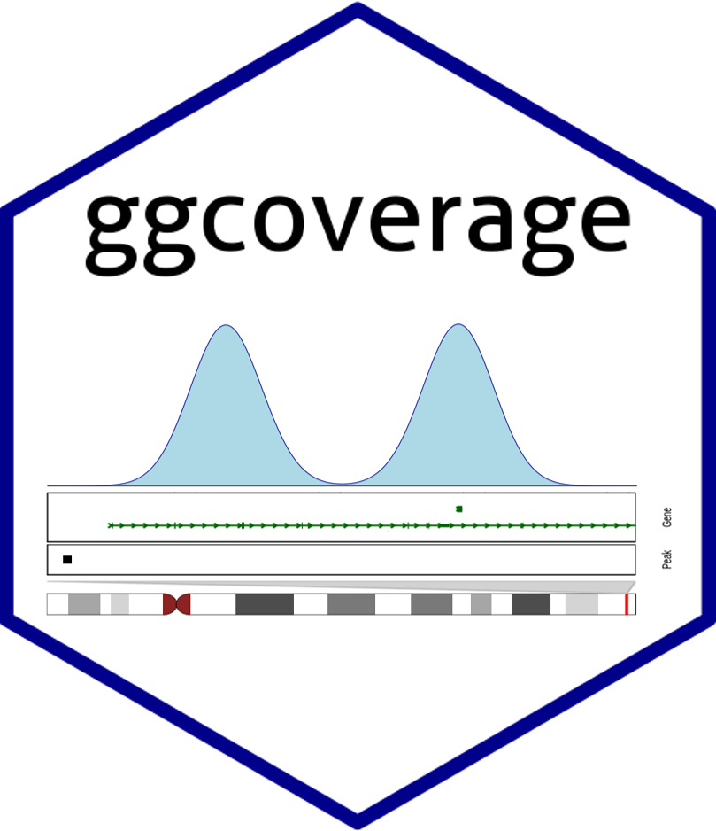

  The goal of `ggcoverage` is simplify the process of visualizing genome coverage. It contains three main parts:

* **Load the data**: `ggcoverage` can load BAM, BigWig (.bw), BedGraph files from various NGS data, including WGS, RNA-seq, ChIP-seq, ATAC-seq, et al.
* **Create genome coverage plot**
* **Add annotations**: `ggcoverage` supports six different annotations:
  * **Base and amino acid annotation**: Visualize genome coverage at single-nucleotide level with bases and amino acids.
  * **GC annotation**: Visualize genome coverage with GC content
  * **gene annotation**: Visualize genome coverage across whole gene
  * **transcription annotation**: Visualize genome coverage across different transcripts
  * **ideogram annotation**: Visualize the region showing on whole chromosome
  * **peak annotation**: Visualize genome coverage and peak identified

`ggcoverage` utilizes `ggplot2` plotting system, so its usage is **ggplot2-style**!

-------------

# RNA-seq data
## Load the data
The RNA-seq data used here are from [Transcription profiling by high throughput sequencing of HNRNPC knockdown and control HeLa cells](https://bioconductor.org/packages/release/data/experiment/html/RNAseqData.HNRNPC.bam.chr14.html), we select four sample to use as example: ERR127307_chr14, ERR127306_chr14, ERR127303_chr14, ERR127302_chr14, and all bam files are converted to bigwig file with [deeptools](https://deeptools.readthedocs.io/en/develop/).

Load metadata:
```{r load_metadata}
# load metadata
meta.file <- system.file("extdata", "RNA-seq", "meta_info.csv", package = "ggcoverage")
sample.meta = read.csv(meta.file)
sample.meta
```

Load track files:
```{r load_track}
# track folder
track.folder = system.file("extdata", "RNA-seq", package = "ggcoverage")
# load bigwig file
track.df = LoadTrackFile(track.folder = track.folder, format = "bw",
                         meta.info = sample.meta)
# check data
head(track.df)
```

Prepare mark region:
```{r prepare_mark}
# create mark region
mark.region=data.frame(start=c(21678900,21732001,21737590),
                       end=c(21679900,21732400,21737650),
                       label=c("M1", "M2", "M3"))
# check data
mark.region
```

Load GTF file:
```{r load_gtf}
gtf.file = system.file("extdata", "used_hg19.gtf", package = "ggcoverage")
gtf.gr = rtracklayer::import.gff(con = gtf.file, format = 'gtf')
```

-------------

## Basic coverage
```{r basic_coverage, eval=FALSE}
basic.coverage = ggcoverage(data = track.df, color = "auto", 
                            mark.region = mark.region, range.position = "out")
basic.coverage
```

```{r basic_coverage_plot, echo=FALSE, fig.height = 6, fig.width = 12, fig.align = "center"}
knitr::include_graphics("../man/figures/README-basic_coverage-1.png")
```

You can also change Y axis style:
```{r basic_coverage_2, eval=FALSE}
basic.coverage = ggcoverage(data = track.df, color = "auto", 
                            mark.region = mark.region, range.position = "in")
basic.coverage
```

```{r basic_coverage_2_plot, echo=FALSE, fig.height = 6, fig.width = 12, fig.align = "center"}
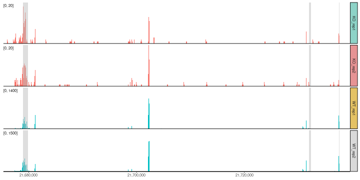
```

-------------

## Add gene annotation
```{r gene_coverage, eval=FALSE}
basic.coverage + 
  geom_gene(gtf.gr=gtf.gr)
```

```{r gene_coverage_plot, echo=FALSE, fig.height = 8, fig.width = 12, fig.align = "center"}
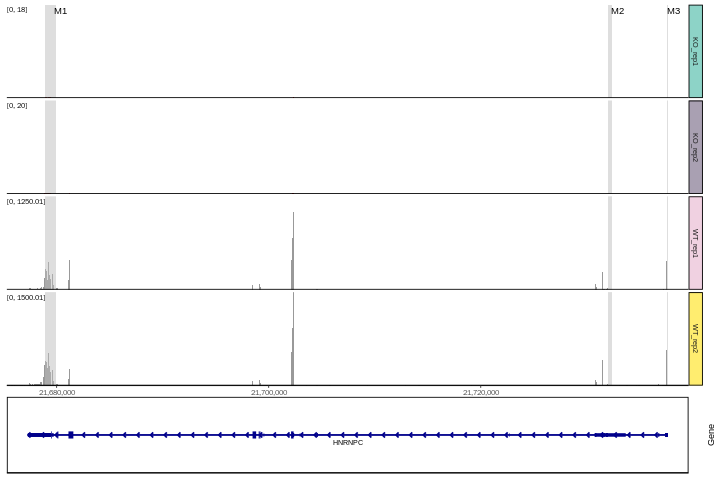
```

-------------

## Add transcript annotation
```{r transcript_coverage, eval=FALSE}
basic.coverage + 
  geom_transcript(gtf.gr=gtf.gr,label.vjust = 1.5)
```

```{r transcript_coverage_plot, echo=FALSE, fig.height = 12, fig.width = 12, fig.align = "center"}
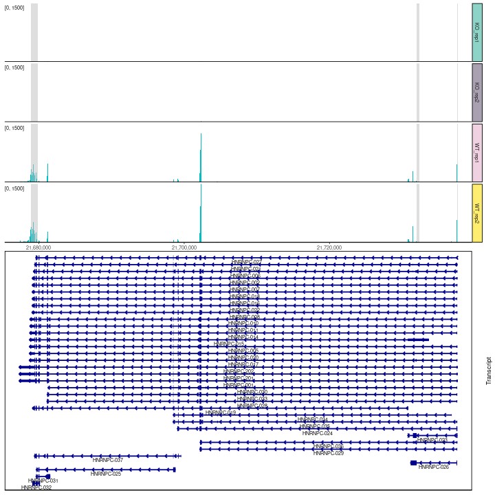
```

-------------

## Add ideogram
```{r ideogram_coverage_1, eval=FALSE}
basic.coverage +
  geom_gene(gtf.gr=gtf.gr) +
  geom_ideogram(genome = "hg19",plot.space = 0)
```

```{r ideogram_coverage_1_plot, echo=FALSE, fig.height = 10, fig.width = 12, fig.align = "center"}
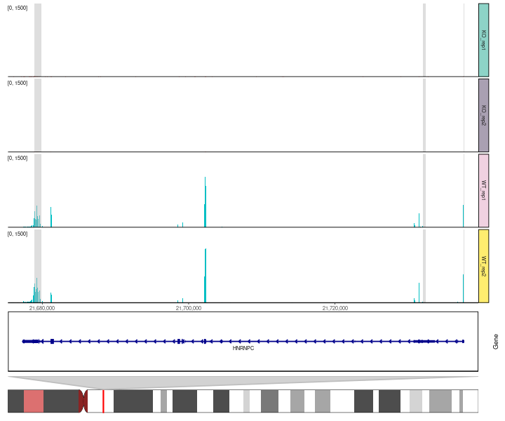
```

```{r ideogram_coverage_2, eval=FALSE}
basic.coverage +
  geom_transcript(gtf.gr=gtf.gr,label.vjust = 1.5) +
  geom_ideogram(genome = "hg19",plot.space = 0)
```

```{r ideogram_coverage_2_plot, echo=FALSE, fig.height = 14, fig.width = 12, fig.align = "center"}
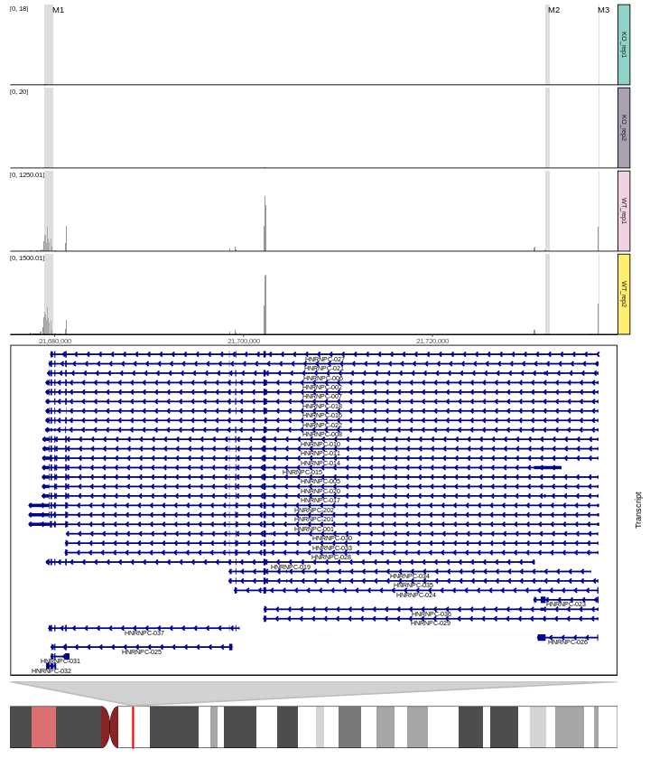
```

-------------

# DNA-seq data
## CNV
### Load the data
The DNA-seq data used here are from [Copy number work flow](http://bioconductor.org/help/course-materials/2014/SeattleOct2014/B02.2.3_CopyNumber.html), we select tumor sample, and get bin counts with `cn.mops::getReadCountsFromBAM` with `WL` 1000.

```{r load_bin_counts}
# track file
track.file = system.file("extdata", "DNA-seq", "CNV_example.txt", package = "ggcoverage")
track.df = read.table(track.file, header = TRUE)
# check data
head(track.df)
```

### Basic coverage
```{r basic_coverage_dna, eval=FALSE}
basic.coverage = ggcoverage(data = track.df,color = NULL, mark.region = NULL,
                            region = 'chr4:61750000-62,700,000', range.position = "out")
basic.coverage
```

```{r basic_coverage_dna_plot, echo=FALSE, fig.height = 6, fig.width = 12, fig.align = "center"}
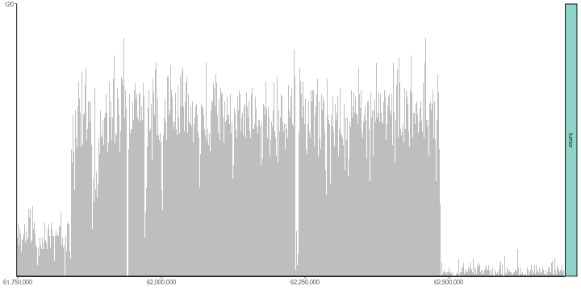
```

### Add annotations
Add **GC**, **ideogram** and **gene** annotations.

```{r gc_coverage, eval=FALSE}
# load genome data
library("BSgenome.Hsapiens.UCSC.hg19")
# create plot
basic.coverage +
  geom_gc(bs.fa.seq=BSgenome.Hsapiens.UCSC.hg19) +
  geom_gene(gtf.gr=gtf.gr) +
  geom_ideogram(genome = "hg19")
```

```{r gc_coverage_plot, echo=FALSE, fig.height = 10, fig.width = 12, fig.align = "center"}
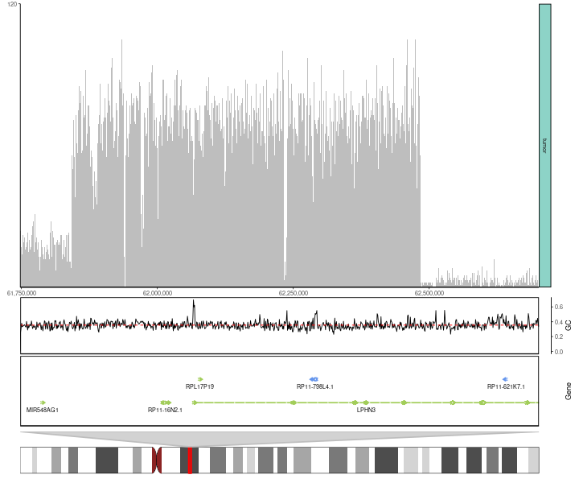
```

---------------------

## Single-nucleotide level
### Load the data
```{r load_single_nuc}
# prepare sample metadata
sample.meta <- data.frame(
  SampleName = c("tumorA.chr4.selected"),
  Type = c("tumorA"),
  Group = c("tumorA")
)
# load bam file
bam.file = system.file("extdata", "DNA-seq", "tumorA.chr4.selected.bam", package = "ggcoverage")
track.df <- LoadTrackFile(
  track.file = bam.file,
  meta.info = sample.meta,
  single.nuc=TRUE, single.nuc.region="chr4:62474235-62474295"
)
head(track.df)
```

### Default color scheme
For base and amino acid annotation, we have following default color schemes, you can change with `nuc.color` and `aa.color` parameters.

Default color scheme for base annotation is `Clustal-style`, more popular color schemes is available [here](https://www.biostars.org/p/171056/).
```{r base_color_scheme, warning=FALSE, fig.height = 2, fig.width = 6, fig.align = "center"}
# color scheme
nuc.color = c("A" = "#ff2b08", "C" = "#009aff", "G" = "#ffb507", "T" = "#00bc0d")
opar <- graphics::par() 
# create plot
graphics::par(mar = c(1, 5, 1, 1))
graphics::image(
  1:length(nuc.color), 1, as.matrix(1:length(nuc.color)),
  col = nuc.color,
  xlab = "", ylab = "", xaxt = "n", yaxt = "n", bty = "n"
)
graphics::text(1:length(nuc.color), 1, names(nuc.color))
graphics::mtext(
  text = "Base", adj = 1, las = 1,
  side = 2
)

# reset par default
graphics::par(opar)
```

Default color scheme for amino acid annotation is from [Residual colours: a proposal for aminochromography](https://academic.oup.com/peds/article/10/7/743/1593029?login=false):
```{r aa_color_scheme, warning=FALSE, fig.height = 9, fig.width = 10, fig.align = "center"}
aa.color = c(
  "D" = "#FF0000", "S" = "#FF2400", "T" = "#E34234", "G" = "#FF8000", "P" = "#F28500",
  "C" = "#FFFF00", "A" = "#FDFF00", "V" = "#E3FF00", "I" = "#C0FF00", "L" = "#89318C",
  "M" = "#00FF00", "F" = "#50C878", "Y" = "#30D5C8", "W" = "#00FFFF", "H" = "#0F2CB3",
  "R" = "#0000FF", "K" = "#4b0082", "N" = "#800080", "Q" = "#FF00FF", "E" = "#8F00FF",
  "*" = "#FFC0CB", " " = "#FFFFFF", " " = "#FFFFFF", " " = "#FFFFFF", " " = "#FFFFFF"
)

graphics::par(mar = c(1, 5, 1, 1))
graphics::image(
  1:5, 1:5, matrix(1:length(aa.color),nrow=5),
  col = rev(aa.color),
  xlab = "", ylab = "", xaxt = "n", yaxt = "n", bty = "n"
)
graphics::text(expand.grid(1:5,1:5), names(rev(aa.color)))
graphics::mtext(
  text = "Amino acids", adj = 1, las = 1,
  side = 2
)

# reset par default
graphics::par(opar)
```

### Add base and amino acid annotation
```{r base_aa_coverage, eval=FALSE}
ggcoverage(data = track.df, color = "grey", range.position = "out", single.nuc=T, rect.color = "white") +
  geom_base(bam.file = bam.file,
            bs.fa.seq = BSgenome.Hsapiens.UCSC.hg19) +
  geom_ideogram(genome = "hg19",plot.space = 0)
```

```{r base_aa_coverage_plot, echo=FALSE, fig.height = 10, fig.width = 12, fig.align = "center"}
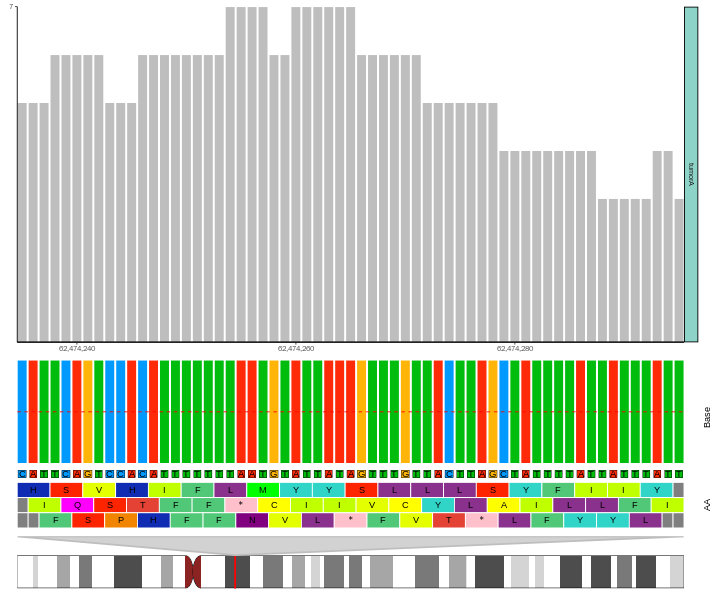
```

---------------------

# ChIP-seq data
The ChIP-seq data used here are from [DiffBind](https://bioconductor.org/packages/release/bioc/html/DiffBind.html), I select four sample to use as example: Chr18_MCF7_input, Chr18_MCF7_ER_1, Chr18_MCF7_ER_3, Chr18_MCF7_ER_2, and all bam files are converted to bigwig file with [deeptools](https://deeptools.readthedocs.io/en/develop/).

Create metadata:
```{r load_metadata_chip}
# load metadata
sample.meta = data.frame(SampleName=c('Chr18_MCF7_ER_1','Chr18_MCF7_ER_2','Chr18_MCF7_ER_3','Chr18_MCF7_input'),
                         Type = c("MCF7_ER_1","MCF7_ER_2","MCF7_ER_3","MCF7_input"),
                         Group = c("IP", "IP", "IP", "Input"))
sample.meta
```

Load track files:
```{r load_track_chip}
# track folder
track.folder = system.file("extdata", "ChIP-seq", package = "ggcoverage")
# load bigwig file
track.df = LoadTrackFile(track.folder = track.folder, format = "bw",
                         meta.info = sample.meta)
# check data
head(track.df)
```

Prepare mark region:
```{r prepare_mark_chip}
# create mark region
mark.region=data.frame(start=c(76822533),
                       end=c(76823743),
                       label=c("Promoter"))
# check data
mark.region
```

-------------

## Basic coverage
```{r basic_coverage_chip, eval=FALSE}
basic.coverage = ggcoverage(data = track.df, color = "auto", region = "chr18:76822285-76900000", 
                            mark.region=mark.region, show.mark.label = FALSE)
basic.coverage
```

```{r basic_coverage_chip_plot, echo=FALSE, fig.height = 6, fig.width = 12, fig.align = "center"}
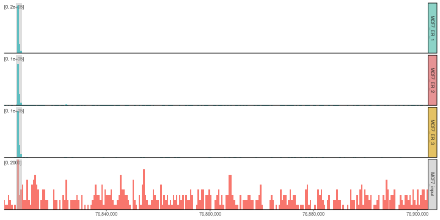
```

-------------

## Add annotations
Add **gene**, **ideogram** and **peak** annotations. To create peak annotation, we first **get consensus peaks** with [MSPC](https://github.com/Genometric/MSPC).

```{r peak_coverage, eval=FALSE}
# get consensus peak file
peak.file = system.file("extdata", "ChIP-seq", "consensus.peak", package = "ggcoverage")

basic.coverage +
  geom_gene(gtf.gr=gtf.gr) +
  geom_peak(bed.file = peak.file) +
  geom_ideogram(genome = "hg19",plot.space = 0)
```

```{r peak_coverage_plot, echo=FALSE, fig.height = 10, fig.width = 12, fig.align = "center"}
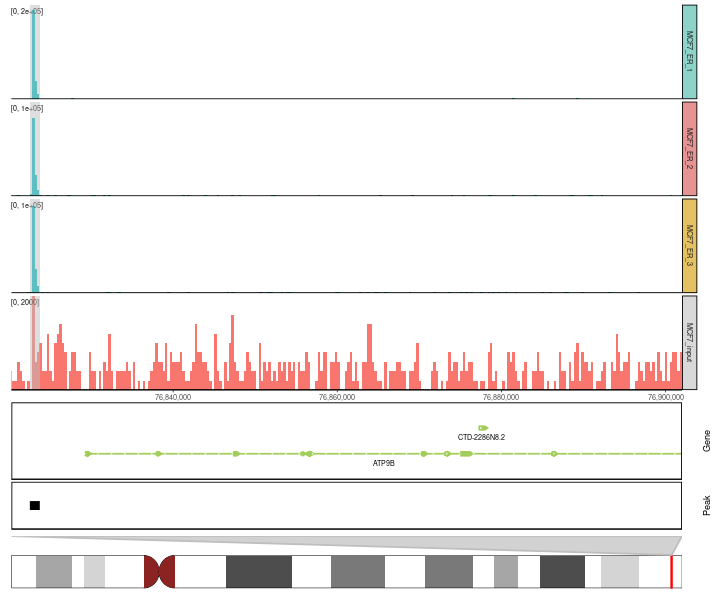
```

---------------------

# Session info
```{r session}
sessionInfo()
```


